# ChapinFlix

## Especificación de Requisitos

### Requisitos Funcionales

### RF-01 — Registro de usuario

| Campo                   | Contenido                                                                                     |
|-------------------------|-----------------------------------------------------------------------------------------------------------------------------------------------------------------------------------------------------------------------------------------------------------------------------------|
| Descripción             | El usuario podrá registrarse en la plataforma utilizando sus datos: nombre, apellido, correo, nombre de usuario, teléfono, dirección, fecha de nacimiento, departamento, sexo, foto de perfil y una lista de categorías de afinidad de contenido.                                    |
| Actor                   | Usuario                                                                                                                                                                                                                                                                            |
| Disparador              | El usuario selecciona la opción de registrarse y completa el formulario de alta.                                                                                                                                                                                                   |
| Precondiciones          | No existir una cuenta previa asociada al mismo correo o nombre de usuario; la plataforma disponible. Se enviará un correo de confirmación para que el usuario confirme su cuenta.                                                                                                                                                                           |
| Flujo básico            | 1 El usuario ingresa los datos solicitados. <br> 2 Envía el formulario de registro. <br> 3 El sistema valida formato y obligatoriedad según reglas vigentes. <br> 4 El sistema crea el perfil y almacena los datos y categorías de afinidad. <br> 5 Se retorna confirmación de envío de correo. 6 El usuario accede al link de confirmación desde su correo. |
| Postcondiciones         | Perfil de usuario creado y datos persistidos con su lista de categorías de afinidad asociada.                                                                                                                                                                                      |
| Criterios de aceptación | Se considera cumplido cuando la plataforma permite registrar usuarios capturando todos los campos indicados, responde éxito al almacenar correctamente y enviar el correo de confirmación y rechaza entradas inválidas o incompletas conforme a las reglas de validación definidas.                                     |


### RF-02 — Login de usuario

| Campo                   | Contenido                                                                                                                                                                                                                 |
|-------------------------|---------------------------------------------------------------------------------------------------------------------------------------------------------------------------------------------------------------------------|
| Descripción             | El usuario puede iniciar sesión como consumidor si y solo si se registró previamente, tiene su cuenta confirmada y el nombre de usuario o correo coincide con su contraseña.                                              |
| Actor                   | Usuario (consumidor)                                                                                                                                                                                                      |
| Disparador              | El usuario ingresa su identificador (nombre de usuario o correo) y contraseña y envía el formulario de inicio de sesión.                                                                                                  |
| Precondiciones          | La cuenta existe y está confirmada; la plataforma está disponible.                                                                                                                                                        |
| Flujo básico            | 1) El usuario ingresa identificador y contraseña. <br> 2) El sistema verifica existencia de la cuenta. <br> 3) El sistema valida que la cuenta esté confirmada. <br> 4) El sistema valida que las credenciales coinciden. <br> 5) El sistema inicia sesión y retorna confirmación. |
| Postcondiciones         | Sesión iniciada para el usuario (p. ej., token o sesión activa disponible para las siguientes operaciones).                                                                                                               |
| Criterios de aceptación | Se considera cumplido cuando solo se permite el acceso a cuentas confirmadas con credenciales correctas y se rechaza con mensaje de error claro cualquier intento con credenciales inválidas, cuenta inexistente o no confirmada.                               |


### RF-03 — Acceso con cuenta gratuita

| Campo                   | Contenido                                                                                                                                                                                                                                  |
|-------------------------|--------------------------------------------------------------------------------------------------------------------------------------------------------------------------------------------------------------------------------------------|
| Descripción             | Al registrarse, el usuario obtiene una cuenta de tipo gratuita que le permite acceder al contenido con limitaciones predefinidas.                                                                                                          |
| Actor                   | Usuario                                                                                                                                                                                                                                    |
| Disparador              | Completar el registro (y posterior acceso a la plataforma).                                                                                                                                                                                |
| Precondiciones          | Cuenta creada (y confirmada según políticas de la plataforma); sesión iniciada.                                                                                                                                                           |
| Flujo básico            | 1) Tras el registro, el sistema asigna por defecto el plan gratuito al perfil del usuario. <br> 2) El usuario navega y accede al contenido permitido por su plan. <br> 3) El sistema aplica las limitaciones configuradas del plan gratuito. |
| Postcondiciones         | Perfil del usuario con plan gratuito activo y políticas de acceso limitadas aplicadas.                                                                                                                                                     |
| Criterios de aceptación | Se considera cumplido cuando: a) todo usuario nuevo queda con plan gratuito asignado automáticamente; b) puede acceder al contenido permitido por dicho plan; c) cualquier acceso que exceda las limitaciones es bloqueado con mensaje claro. |


### RF-04 — Actualización a suscripción premium

| Campo                   | Contenido                                                                                                                                                                                                                  |
|-------------------------|----------------------------------------------------------------------------------------------------------------------------------------------------------------------------------------------------------------------------|
| Descripción             | El usuario podrá actualizar su cuenta desde el plan gratuito a una suscripción premium.                                                                                                                                    |
| Actor                   | Usuario                                                                                                                                                                                                                    |
| Disparador              | El usuario selecciona la opción de suscribirse/actualizar a premium y confirma el proceso.                                                                                                                                |
| Precondiciones          | Cuenta activa en plan gratuito; plan premium disponible.                                                                                                                                |
| Flujo básico            | 1) El usuario elige el plan premium. <br> 2) El sistema muestra precio, términos y método(s) de pago. <br> 3) El usuario confirma y proporciona los datos requeridos. <br> 4) El sistema procesa la solicitud. <br> 5) Se activa el plan premium. |
| Postcondiciones         | Cuenta del usuario con plan premium activo; registro de fecha de activación; permisos y límites actualizados.                                                                                       |
| Criterios de aceptación | Se considera cumplido cuando, tras la confirmación y aprobación , el plan premium queda activo de inmediato; si el pago falla o se cancela, no se cambia el plan y se informa el motivo al usuario.    |


### RF-05 — Edición de datos de cuenta

| Campo                   | Contenido                                                                                                                                                                                                 |
|-------------------------|-----------------------------------------------------------------------------------------------------------------------------------------------------------------------------------------------------------|
| Descripción             | El usuario podrá editar en cualquier momento sus datos de cuenta (p. ej., correo, teléfono, dirección y demás campos permitidos del perfil).                                                              |
| Actor                   | Usuario                                                                                                                                                                                                    |
| Disparador              | El usuario accede a la sección de perfil y guarda cambios.                                                                                                                                                 |
| Precondiciones          | Sesión iniciada; la cuenta existe y está activa.                                                                                                                                                           |
| Flujo básico            | 1) El usuario abre su perfil. <br> 2) Modifica los campos deseados. <br> 3) El sistema valida formato y obligatoriedad. <br> 4) El sistema persiste los cambios. <br> 5) Se muestra confirmación de edición. |
| Postcondiciones         | Datos del perfil actualizados y visibles en la cuenta del usuario.                                                                                                                                         |
| Criterios de aceptación | Se considera cumplido cuando el sistema permite actualizar correo, teléfono, dirección y demás campos permitidos, valida entradas inválidas con mensajes claros y persiste cambios exitosos sin inconsistencias. |


### RF-06 — Gestión de perfiles del hogar

| Campo                   | Contenido                                                                                                                                                                                                                                       |
|-------------------------|-------------------------------------------------------------------------------------------------------------------------------------------------------------------------------------------------------------------------------------------------|
| Descripción             | El usuario podrá crear hasta 5 perfiles, borrar y cambiar entre ellos para que distintas personas de su hogar accedan a catálogos con preferencias diferentes y mantengan historial de consumo independiente.                                    |
| Actor                   | Usuario                                                                                                                                                                                                                                         |
| Disparador              | El usuario ingresa a la sección de “Perfiles” y selecciona crear, cambiar o borrar un perfil.                                                                                                                                                  |
| Precondiciones          | Sesión iniciada; cuenta activa.                                                                                                                                                                                                                 |
| Flujo básico            | 1) Crear: el usuario define nombre (y opcionalmente avatar y preferencias) y guarda. <br> 2) Cambiar: el usuario selecciona un perfil activo para navegar. <br> 3) Borrar: el usuario elige un perfil y confirma su eliminación.               |
| Postcondiciones         | Perfiles creados/actualizados/eliminados según la acción; el perfil activo determina preferencias visibles y el historial que se registra a partir de ese momento.                                                                               |
| Criterios de aceptación | Se considera cumplido cuando: a) no se permite crear más de 5 perfiles; b) se puede cambiar el perfil activo y la navegación refleja sus preferencias; c) cada perfil mantiene historial independiente; d) al borrar un perfil solo se elimina su información sin afectar a los demás. |


### RF-07 — Administración de usuarios (alta, bloqueo y eliminación)

| Campo                   | Contenido                                                                                                                                                                                                                   |
|-------------------------|-----------------------------------------------------------------------------------------------------------------------------------------------------------------------------------------------------------------------------|
| Descripción             | El administrador será capaz de agregar nuevos usuarios, eliminar usuarios existentes o bloquearlos.                                                                                                                         |
| Actor                   | Administrador                                                                                                                                                                                                               |
| Disparador              | El administrador accede al panel de gestión de usuarios y selecciona la acción correspondiente (agregar, bloquear, eliminar).                                                                                               |
| Precondiciones          | Sesión iniciada con rol de administrador; plataforma disponible.                                                                                                                                                             |
| Flujo básico            | 1) Agregar: el administrador ingresa los datos requeridos y confirma la creación. <br> 2) Bloquear: el administrador selecciona un usuario y aplica el estado bloqueado. <br> 3) Eliminar: el administrador confirma la eliminación del usuario. |
| Postcondiciones         | Usuario creado, bloqueado o eliminado según la acción ejecutada.                                                                                                                                                            |
| Criterios de aceptación | Se considera cumplido cuando solo un administrador puede realizar estas acciones y, tras bloquear o eliminar, el usuario afectado no puede acceder a la plataforma; las operaciones exitosas muestran confirmación y las inválidas se rechazan con mensaje claro. |

### RF-08 — Gestión de descuentos y promociones

| Campo                   | Contenido                                                                                                                                                                                                                                   |
|-------------------------|---------------------------------------------------------------------------------------------------------------------------------------------------------------------------------------------------------------------------------------------|
| Descripción             | El administrador será capaz de crear, modificar o eliminar descuentos y promociones para los usuarios.                                                                                                                                       |
| Actor                   | Administrador                                                                                                                                                                                                                               |
| Disparador              | El administrador accede al módulo de “Descuentos y promociones” y selecciona crear, editar o eliminar.                                                                                                                                      |
| Precondiciones          | Sesión iniciada con rol de administrador; plataforma disponible.                                                                                                                                                                            |
| Flujo básico            | 1) Crear: define nombre, tipo de descuento (porcentaje o monto fijo), valor y vigencia (inicio/fin); guarda. <br> 2) Modificar: selecciona una promoción existente, actualiza campos y guarda. <br> 3) Eliminar: selecciona una promoción y confirma su eliminación. |
| Postcondiciones         | Descuentos o promociones creados, actualizados o eliminados según la acción; los cambios se reflejan en la aplicación donde corresponda.                     |
| Criterios de aceptación | Se considera cumplido cuando solo un administrador puede realizar estas acciones;; al eliminar deja de aplicarse de inmediato; operaciones válidas muestran confirmación y las inválidas se rechazan con mensaje claro.        |


### RF-09 — Seguimiento y gestión de reportes de usuarios

| Campo                   | Contenido                                                                                                                                                                                                                                                                      |
|-------------------------|--------------------------------------------------------------------------------------------------------------------------------------------------------------------------------------------------------------------------------------------------------------------------------|
| Descripción             | El administrador podrá dar seguimiento a usuarios reportados y gestionar los reportes asociados (p. ej., bloquear/desbloquear cuentas, aplicar/quitar descuentos u otras medidas).                                                                                             |
| Actor                   | Administrador                                                                                                                                                                                                                                                                  |
| Disparador              | El administrador accede al módulo de “Reportes” y selecciona un reporte o un usuario reportado.                                                                                                                                                                                |
| Precondiciones          | Sesión iniciada con rol de administrador; existen reportes registrados en el sistema.                                                                                                                                                                                          |
| Flujo básico            | 1) Listar usuarios reportados y/o reportes abiertos. <br> 2) Ver detalle del reporte |
| Postcondiciones         | Reporte actualizado con su estado y acciones aplicadas; historial de acciones y notas registrado para auditoría.                                                                                                                                                               |
| Criterios de aceptación | Se considera cumplido cuando: a) se pueden listar y filtrar reportes por estado de usuario;                   |


### RF-10 — Gestión de contenido por plan y categorías

| Campo                   | Contenido                                                                                                                                                                                                                                             |
|-------------------------|-------------------------------------------------------------------------------------------------------------------------------------------------------------------------------------------------------------------------------------------------------|
| Descripción             | El gestor de contenido podrá agregar contenido y asignarlo a tipos de usuario (p. ej., gratuito), agregar categorías al contenido y editar sus valores, incluyendo ventanas de disponibilidad por fechas.                                              |
| Actor                   | Gestor de contenido                                                                                                                                                                                                                                   |
| Disparador              | El gestor accede al módulo de “Contenido” y selecciona crear o editar.                                                                                                                                                                               |
| Precondiciones          | Sesión iniciada con rol de gestor de contenido; taxonomía de categorías disponible.                                                                                                                                                                  |
| Flujo básico            | 1) Crear contenido con título, descripción y archivo(s). <br> 2) Definir público objetivo por tipo de plan (p. ej., gratuito). <br> 3) Asignar una o más categorías. <br> 4) Configurar disponibilidad (fecha inicio/fin). <br> 5) Guardar cambios. |
| Postcondiciones         | Contenido creado/actualizado con categorías y reglas de disponibilidad aplicadas al/los tipo(s) de usuario definidos.                                                                                                                                 |
| Criterios de aceptación | Se considera cumplido cuando: a) se puede asignar contenido a tipo(s) de usuario (incluyendo gratuito); b) se pueden agregar/editar categorías; c) la disponibilidad por fechas restringe el acceso fuera de la ventana configurada; d) se confirma la operación o se muestra error claro. |


### RF-11 — Carga masiva de contenido

| Campo                   | Contenido                                                                                                                                                                                                                   |
|-------------------------|-----------------------------------------------------------------------------------------------------------------------------------------------------------------------------------------------------------------------------|
| Descripción             | El gestor de contenido dispone de un módulo para subir contenido de manera masiva.                                                                                                                                          |
| Actor                   | Gestor de contenido                                                                                                                                                                                                          |
| Disparador              | El gestor accede al módulo de carga masiva y selecciona un archivo para importar.                                                                                                                                           |
| Precondiciones          | Sesión iniciada con rol de gestor; formato de archivo soportado (p. ej., CSV/XLSX/JSON) y estructura válida; catálogos/taxonomías disponibles.                                                                             |
| Flujo básico            | 1) (Opcional) Descargar plantilla. <br> 2) Preparar archivo con registros. <br> 3) Cargar archivo. <br> 4) El sistema valida estructura y campos obligatorios y muestra previsualización. <br> 5) Confirmar importación. <br> 6) Registrar resultados. |
| Postcondiciones         | Contenido creado/actualizado en lote; registro de resultado con conteo de insertados, actualizados y rechazados y sus motivos.                                                                                              |
| Criterios de aceptación | Se considera cumplido cuando se pueden importar múltiples registros en una sola operación, se validan y rechazan filas inválidas con mensajes claros (sin afectar las válidas) y se genera un resumen de la carga realizada. |

### RF-12 — Login diferenciado para gestor y administrador

| Campo                   | Contenido                                                                                                                                                                                                                   |
|-------------------------|-----------------------------------------------------------------------------------------------------------------------------------------------------------------------------------------------------------------------------|
| Descripción             | Existe un login distinto para los tipos de usuario Gestor de Contenido y Administrador, separado del login de consumidores.                                                                                                  |
| Actor                   | Gestor de contenido; Administrador                                                                                                                                                                                           |
| Disparador              | El usuario de backoffice accede al portal/endpoint de administración e ingresa sus credenciales.                                                                                                                            |
| Precondiciones          | Cuenta existente con el rol correspondiente (gestor o administrador); cuenta confirmada; plataforma disponible.                                                                                                             |
| Flujo básico            | 1) Navegar al login de backoffice. <br> 2) Ingresar usuario/contraseña. <br> 3) El sistema valida credenciales y rol. <br> 4) Se inicia sesión en la consola con los permisos del rol.                                      |
| Postcondiciones         | Sesión iniciada en backoffice con el rol adecuado y acceso a los módulos permitidos para dicho rol.                                                                                                                         |
| Criterios de aceptación | Se considera cumplido cuando: a) el acceso a backoffice solo es posible mediante el login diferenciado; b) el login de consumidores no permite acceso a backoffice; c) intentos con rol incorrecto son rechazados con mensaje claro; d) los permisos se aplican por rol. |

### RF-13 — Visualización de catálogo por secciones con carruseles

| Campo                   | Contenido                                                                                                                                                                                                                                                                                                                                                                         |
|-------------------------|-----------------------------------------------------------------------------------------------------------------------------------------------------------------------------------------------------------------------------------------------------------------------------------------------------------------------------------------------------------------------------------|
| Descripción             | El usuario consumidor registrado podrá visualizar el catálogo organizado en secciones: Vistos recientemente, Más populares, Top 15, Recientemente agregados, Ver otra vez y una sección de Géneros (categorías). Cada sección mostrará su contenido mediante un carrusel.                                                                                                          |
| Actor                   | Usuario (consumidor registrado)                                                                                                                                                                                                                                                                                                                                                   |
| Disparador              | El usuario accede a la página principal de catálogo estando autenticado.                                                                                                                                                                                                                                                                                                          |
| Precondiciones          | Sesión iniciada; existe contenido disponible en el sistema (y, para secciones personalizadas, historial del perfil activo).                                                                                                                                                                                                                                                       |
| Flujo básico            | 1) El sistema consulta las colecciones para cada sección. <br> 2) Para cada sección con contenido, renderiza un carrusel con tarjetas (título/imagen). <br> 3) El usuario navega el carrusel con controles (anterior/siguiente). <br> 4) Al seleccionar un ítem, se abre su ficha/detalle.                                                                                       |
| Postcondiciones         | Secciones visibles con su contenido correspondiente; navegación fluida por carruseles y registro de interacción para alimentar Vistos recientemente y Ver otra vez del perfil activo.                                                                                                                                                                                             |
| Criterios de aceptación | a) Cada sección se muestra solo si tiene contenido; si no, se oculta. <br> b) Top 15 lista exactamente 15 elementos (o menos si no hay suficientes). <br> c) Recientemente agregados se ordena por fecha de alta descendente; Más populares por métricas de popularidad; Vistos recientemente por fecha de visualización; Ver otra vez según historial del perfil. <br> d) Los carruseles permiten desplazamiento y selección sin errores. |


### RF-14 — Navegación por categorías (géneros)

| Campo                   | Contenido                                                                                                                                                                                                 |
|-------------------------|-----------------------------------------------------------------------------------------------------------------------------------------------------------------------------------------------------------|
| Descripción             | El usuario consumidor registrado podrá acceder a una sección de categorías (géneros) para explorar el contenido disponible por cada género.                                                                |
| Actor                   | Usuario (consumidor registrado)                                                                                                                                                                           |
| Disparador              | El usuario selecciona la opción “Categorías”/“Géneros” desde la navegación.                                                                                                                               |
| Precondiciones          | Sesión iniciada; existen categorías configuradas con contenido asociado.                                                                                                                                  |
| Flujo básico            | 1) El sistema muestra el listado de géneros disponibles. <br> 2) El usuario selecciona un género. <br> 3) Se despliega el contenido del género elegido (lista, grid o carrusel) con opciones de ordenar/filtrar si aplica. |
| Postcondiciones         | Se registra la navegación para personalización futura (p. ej., vistos recientemente) y queda visible el catálogo filtrado por el género seleccionado.                                                     |
| Criterios de aceptación | a) La sección de categorías es accesible desde la navegación principal. b) Solo se listan géneros con contenido (o se muestra estado vacío informativo). c) Al elegir un género, se presenta su contenido sin errores. |

### RF-15 — Visualización de detalle de contenido

| Campo                   | Contenido                                                                                                                                                                                                                                       |
|-------------------------|-------------------------------------------------------------------------------------------------------------------------------------------------------------------------------------------------------------------------------------------------|
| Descripción             | Al hacer clic sobre un contenido, se abrirá la sección de visualización que, por ahora, mostrará únicamente: título del contenido, imágenes previas, un resumen e información relevante (p. ej., géneros, duración, fecha de publicación, clasificación, idioma).                    |
| Actor                   | Usuario (consumidor registrado)                                                                                                                                                                                                                |
| Disparador              | Clic en una tarjeta/ítem de contenido desde catálogo o categorías.                                                                                                                                                                             |
| Precondiciones          | Sesión iniciada; el contenido existe y es accesible según el plan del usuario; metadatos e imágenes disponibles.                                                                                                                               |
| Flujo básico            | 1) Capturar clic del usuario. <br> 2) Consultar metadatos del contenido. <br> 3) Renderizar la vista de detalle con título, imágenes previas, resumen e información relevante. <br> 4) Habilitar navegación para volver a la lista/carrusel previo.                                |
| Postcondiciones         | Se registra la visita del contenido para el perfil activo (vistos recientemente/ver otra vez).                                                                                                                                                  |
| Criterios de aceptación | a) La vista muestra, como mínimo, título, imágenes previas, resumen e información relevante. <br> b) Si falta alguna imagen, se muestra un placeholder. <br> c) Si el contenido no existe o no es accesible, se presenta un mensaje de error claro y no se rompe la navegación. |


### RF-16 — Recomendación destacada en portada

| Campo                   | Contenido                                                                                                                                                                                                                          |
|-------------------------|------------------------------------------------------------------------------------------------------------------------------------------------------------------------------------------------------------------------------------|
| Descripción             | Al entrar a la aplicación se mostrará una recomendación con imagen en grande, título y breve descripción; al hacer clic, llevará a la sección de visualización (detalle) de ese contenido.                                         |
| Actor                   | Usuario (consumidor registrado)                                                                                                                                                                                                    |
| Disparador              | Ingreso a la aplicación / carga de la página principal.                                                                                                                                                                            |
| Precondiciones          | Sesión iniciada; existe al menos un contenido marcado como “recomendado” con imagen, título y descripción disponibles; el contenido es accesible según el plan del usuario.                                                       |
| Flujo básico            | 1) Cargar portada. <br> 2) Renderizar módulo de recomendación con imagen grande, título y descripción. <br> 3) Al hacer clic en la recomendación, navegar a la vista de detalle del contenido.                                     |
| Postcondiciones         | Se registra la interacción (impresión/clic) para el perfil activo; el usuario queda en la vista de detalle del contenido.                                                                                                          |
| Criterios de aceptación | a) La recomendación se muestra solo si hay contenido recomendado válido; de lo contrario, el módulo se oculta o muestra placeholder. <br> b) El clic navega correctamente a la vista de detalle. <br> c) No se rompe la navegación. |

### RF-17 — Favoritos del usuario

| Campo                   | Contenido                                                                                                                                                                                                                                       |
|-------------------------|-------------------------------------------------------------------------------------------------------------------------------------------------------------------------------------------------------------------------------------------------|
| Descripción             | El usuario podrá agregar contenido a favoritos y acceder a una sección dedicada donde se listan todos sus favoritos guardados.                                                                                                                  |
| Actor                   | Usuario (consumidor registrado, por perfil activo)                                                                                                                                                                                              |
| Disparador              | Clic en “Agregar a favoritos”/icono en tarjetas o en la vista de detalle; acceso a la sección “Favoritos” desde la navegación.                                                                                                                 |
| Precondiciones          | Sesión iniciada; contenido existente y accesible según el plan; perfil activo seleccionado.                                                                                                                                                     |
| Flujo básico            | 1) El usuario marca/desmarca un contenido como favorito (toggle). <br> 2) El sistema persiste la relación (perfil–contenido) y actualiza el estado visual. <br> 3) En la sección “Favoritos”, se listan los ítems guardados con opciones de abrir o quitar. |
| Postcondiciones         | Favorito añadido o removido para el perfil activo; la sección “Favoritos” refleja los cambios inmediatamente.                                                                                                                                    |
| Criterios de aceptación | a) No se permiten duplicados del mismo contenido por perfil. <br> b) Quitar de favoritos lo elimina de la lista. <br> c) La sección “Favoritos” es accesible y muestra los ítems ordenados por fecha de agregado (recientes primero). <br> d) Si no hay favoritos, se muestra estado vacío informativo. |

### RF-18 — Lista “Ver más tarde”

| Campo                   | Contenido                                                                                                                                                                                                                                       |
|-------------------------|-------------------------------------------------------------------------------------------------------------------------------------------------------------------------------------------------------------------------------------------------|
| Descripción             | El usuario podrá agregar contenido a “Ver más tarde” y acceder a una lista dedicada con los elementos guardados para ver posteriormente.                                                                                                        |
| Actor                   | Usuario (consumidor registrado, por perfil activo)                                                                                                                                                                                              |
| Disparador              | Clic en “Ver más tarde” (toggle) en tarjetas o en la vista de detalle; acceso a la sección “Ver más tarde” desde la navegación.                                                                                                                |
| Precondiciones          | Sesión iniciada; contenido existente y accesible según el plan; perfil activo seleccionado.                                                                                                                                                     |
| Flujo básico            | 1) El usuario marca/desmarca un contenido como “Ver más tarde”. <br> 2) El sistema persiste la relación (perfil–contenido) y actualiza el estado visual. <br> 3) En la sección “Ver más tarde”, se listan los ítems guardados con opción de abrir o quitar. |
| Postcondiciones         | Contenido añadido o removido de la lista “Ver más tarde” para el perfil activo; la sección refleja los cambios inmediatamente.                                                                                                                  |
| Criterios de aceptación | a) No se permiten duplicados del mismo contenido por perfil. <br> b) Quitar el contenido lo elimina de la lista. <br> c) La sección “Ver más tarde” ordena por fecha de agregado (recientes primero). <br> d) Si la lista está vacía, se muestra estado informativo. |


### RF-19 — Cierre de sesión (logout)

| Campo                   | Contenido                                                                                                                                                                                                                     |
|-------------------------|-------------------------------------------------------------------------------------------------------------------------------------------------------------------------------------------------------------------------------|
| Descripción             | Todos los tipos de usuario con sesión activa podrán salir de la aplicación mediante un botón de “Cerrar sesión”.                                                                                                              |
| Actor                   | Usuario (consumidor, gestor de contenido, administrador)                                                                                                                                                                      |
| Disparador              | Clic en el botón/enlace de “Cerrar sesión” en la interfaz.                                                                                                                                                                    |
| Precondiciones          | Sesión iniciada.                                                                                                                                                                                                              |
| Flujo básico            | 1) El usuario hace clic en “Cerrar sesión”. <br> 2) El sistema invalida la sesión/token (y refresh, si aplica). <br> 3) Se limpia el estado local (cookies/almacenamiento). <br> 4) Se redirige a la pantalla pública/login. |
| Postcondiciones         | Sesión finalizada; no es posible acceder a recursos protegidos sin volver a autenticarse.                                                                                                                                     |
| Criterios de aceptación | a) Tras el logout, cualquier intento de usar el token anterior es rechazado. <br> b) La interfaz ya no muestra opciones de usuario autenticado. <br> c) Se redirige correctamente a la vista pública o de inicio de sesión.  |


### RF-20 — Migración de contenido a MongoDB.

| Campo                   | Contenido                                                                                                                                                                                                                     |
|-------------------------|-------------------------------------------------------------------------------------------------------------------------------------------------------------------------------------------------------------------------------|
| Descripción             | El catálogo de contenidos se almacena en una base de datos NoSQL (MongoDB), manteniendo colecciones para contenidos, medios, géneros, visibilidades por plan y ventanas de disponibilidad.                                                                                                              |
| Actor                   | Gestor de contenido; Servicio de catálogo (backend).                                                                                                                                                                    |
| Disparador              | El gestor utiliza el módulo de contenido o un proceso de importación para crear/actualizar registros; el backend consulta el catálogo.                                                                                                                                                                    |
| Precondiciones          | MongoDB operativo y accesible. Esquema/colecciones definidos. Datos mínimos de contenido disponibles (título, medios, planes/ventanas).                                                                                                                                                                                                              |
| Flujo básico            | 1. Crear/actualizar documento content (título, sinopsis, metadatos). 2. Asociar media (poster/backdrop), genres y plans. 3) Registrar availability (start_at/end_at) en el documento. 4) Guardar/actualizar índices (texto por title/synopsis, filtros por plans, availability). 5) Consultar catálogo con filtros por plan y ventana vigente. |
| Postcondiciones         | 1) Contenidos persistidos en MongoDB con relaciones embebidas/referenciadas. 2) Consultas listas para catálogo, búsqueda y detalle.                                                                                                                                     |
| Criterios de aceptación | a) Se crean/actualizan documentos válidos en MongoDB. b) Las consultas por plan y ventana devuelven solo contenido vigente. c) La búsqueda full-text por title/synopsis funciona. d) Operaciones fallidas devuelven error claro (validaciones, campos requeridos). |


### RF-21 — Servicio de pagos (Stripe, tokenización, planes Premium).

| Campo                   | Contenido                                                                                                                                                                                                                     |
|-------------------------|-------------------------------------------------------------------------------------------------------------------------------------------------------------------------------------------------------------------------------|
| Descripción             | El usuario puede activar plan Premium mediante pago con tarjeta usando Stripe (test). El sistema tokeniza el método de pago, confirma el cargo y actualiza el estado de suscripción.                                                                                                              |
| Actor                   | Usuario (consumidor); Payment Service; Stripe.                                                                                                                                                                      |
| Disparador              | El usuario hace clic en “Actualizar a Premium” y completa datos de pago.                                                                                                                                                                    |
| Precondiciones          | 1) Cuenta de usuario existente y autenticada. 2) Claves Stripe test configuradas; API alcanzable. 3) Frontend con Stripe.js/Elements.                                                                                                                                                                                                              |
| Flujo básico            | 1) Frontend crea Payment Method (tokenizado) con Stripe. 2) Backend crea y confirma un PaymentIntent (solo tarjeta, sin redirecciones). 3) Stripe responde succeeded / requires_action / failed. 4) Si succeeded, backend marca suscripción PREMIUM para el usuario. 5) Respuesta al cliente con resultado y estado de plan. |
| Postcondiciones         | Pago registrado en Stripe; usuario con plan actualizado (si aprobado). Registro de suscripción actualizado (fecha y plan vigente).                                                                                                                                     |
| Criterios de aceptación | a) Se procesa el pago en modo test con tarjeta válida (4242…). b) Estados y errores se muestran claramente (fallo de tarjeta, cancelación). c) Tras pago exitoso, el plan del usuario es PREMIUM de inmediato. d) No se almacenan datos sensibles de tarjeta en el backend (solo tokens/IDs de Stripe).  |


### RF-22 — Servicio de streaming de contenido.

| Campo                   | Contenido                                                                                                                                                                                                                     |
|-------------------------|-------------------------------------------------------------------------------------------------------------------------------------------------------------------------------------------------------------------------------|
| Descripción             | El sistema entrega video bajo demanda usando peticiones parciales (HTTP Range) para permitir reproducción progresiva, saltos (seek) y buffering eficiente.                                                                                                              |
| Actor                   | Usuario (consumidor); Streaming Service.                                                                                                                                                                      |
| Disparador              | El usuario abre un contenido y el reproductor solicita el recurso de video.                                                                                                                                                                    |
| Precondiciones          | 1) Archivo de video disponible en el almacenamiento configurado (PVC/volumen). 2) Contenido accesible según plan y ventana vigente (autorización aplicada si corresponde). 3) CORS configurado para el origen del frontend.                                                                                                                                                                                                              |
| Flujo básico            | 1) El reproductor solicita /stream/:file con o sin cabecera Range. 2) El servicio valida existencia del archivo y autorización (opcional: verifica plan/ventana/JWT). 3) Si hay Range, responde 206 Partial Content con Content-Range y el chunk solicitado. 4) El reproductor realiza nuevas solicitudes para continuar buffer/seek. 5) Se registran métricas básicas (hits, bytes servidos). |
| Postcondiciones         | 1) El cliente reproduce el video con soporte de seek/buffering. 2) No se entrega contenido fuera de la ventana ni a planes no permitidos (si aplica control).                                                                                                                                     |
| Criterios de aceptación | a) Respuestas incluyen Accept-Ranges: bytes y 206 para rangos válidos. b) Se maneja 416 Range Not Satisfiable cuando corresponde. c) Seek funciona (solicitudes con distintos rangos). d) Errores claros para archivo no encontrado o acceso no autorizado.  |


### RF-23 — Despliegue en Kubernetes con CI/CD (auto-deploy desde rama master).

| Campo                   | Contenido                                                                                                                                                                                                                     |
|-------------------------|-------------------------------------------------------------------------------------------------------------------------------------------------------------------------------------------------------------------------------|
| Descripción             | Cada cambio en la rama master dispara un pipeline que construye imágenes, las publica y despliega automáticamente en el clúster de Kubernetes.                                                                                                              |
| Actor                   | Desarrollador; Pipeline de CI/CD; Clúster Kubernetes (GKE/Minikube).                                                                                                                                                                      |
| Disparador              | Merge/push a la rama master.                                                                                                                                                                    |
| Precondiciones          | 1) Repositorio con pipeline definido (GitHub Actions/GitLab CI). 2) Acceso a registry (Artifact Registry) y credenciales de despliegue. 3) Manifests/Helm Charts versionados.                                                                                                                                                                                                              |
| Flujo básico            | Commit/merge en master. Pipeline: lint + tests + build de imágenes Docker. Push de imágenes al registry con tag (sha/semver). kubectl apply / helm upgrade al clúster (namespace del proyecto). Verificación de salud (readiness/liveness) y notificación de estado. |
| Postcondiciones         | Nueva versión desplegada y corriendo en Kubernetes. Registro de build/deploy con logs y artefactos.                                                                                                                                     |
| Criterios de aceptación | a) Un commit en master produce una imagen nueva y un despliegue exitoso. b) Si un paso falla (tests, build, deploy), el pipeline marca fallo y no promueve cambios. c) Servicios quedan saludables (readiness OK) y accesibles por Ingress. d) Queda historial de releases (tags/SHAs) y logs del pipeline consultables.  |


### Requisitos No Funcionales

### RNF-1 — Hasheo de Contraseñas


| Campo                  | Contenido |
|------------------------|----------|
| Categoría              | Seguridad |
| Enunciado medible      | Todas las contraseñas de usuarios se almacenan como hashes bcrypt con cost 10 y sal automática; longitud mínima de contraseña 8 caracteres. El tiempo de hash por operación debe estar entre 100 y 500 ms en la máquina de referencia de desarrollo. |
| Alcance                | Servicio de autenticación (registro, cambio de contraseña, login) |
| Método de verificación | Prueba unitaria que verifica: 1) que el algoritmo usado es bcrypt con cost 10; 2) que `matches()` valida correctamente; 3) que el tiempo de hash está dentro del rango objetivo. Revisión rápida de logs para confirmar que no se imprime la contraseña en claro. |
| Evidencia esperada     | Reporte de CI con tests en verde y captura de tiempos de hash; búsqueda en logs sin ocurrencias de contraseñas en texto plano. |
| Prioridad              | Must |
| Propietario            | Equipo Auth |
| Criterios de aceptación| Se considera cumplido si: a) no existe almacenamiento reversible ni texto plano; b) el cost configurado es 10; c) los tests de verificación y tiempo pasan; d) el login valida correctamente con `matches()`. |

### RNF-SEG-02 — Políticas de credenciales y antifuerza bruta
| Campo                  | Contenido |
|------------------------|----------|
| Enunciado medible      | Contraseñas ≥ 12 caracteres; bloqueos progresivos tras 5 intentos fallidos por cuenta/IP; MFA obligatorio para roles admin/gestor. |
| Alcance                | Portales consumidor y backoffice |
| Verificación           | Tests E2E de login/lockout + revisión de políticas MFA en backoffice |
| Evidencia              | Reporte CI y dashboard de intentos fallidos por minuto |
| Prioridad              | Must |
| Propietario            | Seguridad/AppSec |
| Criterios              | Lockout se activa y expira según política; MFA requerido para admin/gestor. |

### RNF-ESC-01 — Capacidad base por servicio
| Campo                  | Contenido |
|------------------------|----------|
| Categoría              | Escalabilidad / Rendimiento |
| Enunciado medible      | Con 2 réplicas por servicio, cada endpoint principal mantiene p95 ≤ 300 ms a 50 rps totales (distribuidos) durante 3 minutos, con tasa de error < 1%. |
| Alcance                | Gateway Service + authentication-service, content-service, user-service|
| Método de verificación | Prueba de carga (k6) con tráfico a los endpoints de cada servicio; dashboard de latencias por endpoint |
| Evidencia esperada     | Reporte con percentiles y error < 1% |
| Prioridad              | Must |
| Criterios de aceptación| Todos los servicios cumplen el umbral simultáneamente en la misma corrida de prueba. |

### RNF-ESC-02 — Autoescalado horizontal por CPU (HPA)
| Campo                  | Contenido |
|------------------------|----------|
| Categoría              | Escalabilidad |
| Enunciado medible      | Cada servicio escala 2→5 réplicas si CPU > 60% por 2 min y vuelve a 2 si CPU < 30% por 5 min, sin oscilaciones sostenidas. |
| Alcance                | auth-svc, catalog-svc, content-svc, profile-svc |
| Método de verificación | `kubectl describe hpa`, eventos de escala y métricas de CPU; conteo de réplicas en tiempo |
| Evidencia esperada     | Eventos “Scaled up/down” y estabilización a un nivel consistente |
| Prioridad              | Must |
| Criterios de aceptación| Escala dentro de las ventanas indicadas y se mantiene estable tras la carga. |

### RNF-DISP-01 — Uptime mensual
| Campo                  | Contenido |
|------------------------|----------|
| Categoría              | Disponibilidad |
| Enunciado medible      | La API pública (gateway) y los 4 microservicios mantienen ≥ 99.5% de disponibilidad mensual (≤ 3h 39m de caída/mes). Un request 5xx o timeout del health/business-check cuenta como indisponibilidad. |
| Alcance                | Gateway-Service, authentication-service, content-service, User-service |
| Método de verificación | Synthetics cada 30 s a `/health/ready` y a 1 endpoint de negocio por servicio; cálculo de uptime por ventana mensual. |
| Evidencia esperada     | Dashboard con uptime por servicio y reporte mensual exportable. |
| Prioridad              | Must |
| Criterios de aceptación| Uptime mensual registrado ≥ 99.5% en gateway y en cada servicio. |

### RNF-DISP-02 — Réplicas y reparto entre nodos
| Campo                  | Contenido |
|------------------------|----------|
| Categoría              | Disponibilidad / Resiliencia |
| Enunciado medible      | Cada servicio corre con **≥ 2 réplicas** y se distribuye en **nodos distintos** (anti-afinidad o `topologySpreadConstraints`) para evitar punto único de falla. |
| Alcance                | Los 4 microservicios |
| Método de verificación | `kubectl get pods -o wide` + inspección de anti-afinidad/spread; simulación de caída de un nodo. |
| Evidencia esperada     | Réplicas en nodos diferentes; servicio sigue atendiendo si un nodo cae. |
| Prioridad              | Must |
| Criterios de aceptación| Ante caída de un nodo, el servicio permanece disponible (no 5xx generalizados). |

### RNF-UX-01 — Accesibilidad mínima (teclado y contraste)

| Campo                  | Contenido |
|------------------------|----------|
| Categoría              | Usabilidad / Accesibilidad |
| Enunciado medible      | La home y la vista de detalle obtienen ≥ 90 de puntaje de Accesibility en Lighthouse; todos los elementos interactivos son navegables con teclado (Tab/Shift+Tab) y muestran foco visible; imágenes clave tienen `alt`. |
| Alcance                | Frontend web (home, detalle de contenido) |
| Método de verificación | Ejecución de Lighthouse (modo Desktop) y prueba manual con teclado (Tab/Shift+Tab, Enter/Espacio). |
| Evidencia esperada     | Captura o reporte Lighthouse ≥ 90 y video/gif corto o nota de verificación de navegación por teclado. |
| Prioridad              | Should |
| Criterios de aceptación| Puntaje ≥ 90 en ambas vistas; Tab recorre todos los controles en orden lógico con foco visible; no hay elementos “trampa” sin foco ni atajos rotos. |

### RNF-PERF-02 — Rendimiento de la Home (cliente)

| Campo                  | Contenido |
|------------------------|----------|
| Categoría              | Rendimiento (Web) |
| Enunciado medible      | En la Home del cliente se cumple: **LCP ≤ 2.5 s**, **INP ≤ 200 ms** y **CLS ≤ 0.10** (medición móvil con Lighthouse, configuración por defecto). El **transfer size** total de JS en la Home es **≤ 200 KB** y los recursos estáticos se sirven comprimidos (`gzip/br`). |
| Alcance                | Frontend web ( “/home”) |
| Método de verificación | Ejecutar Lighthouse en modo móvil (DevTools o `lighthouse --view --only-categories=performance`) y registrar LCP/INP/CLS; verificar en Network el tamaño total de JS y el encabezado `Content-Encoding`. |
| Evidencia esperada     | Reporte Lighthouse con métricas dentro de umbral y captura de Network mostrando `Content-Encoding` y tamaño de JS ≤ 200 KB. |
| Prioridad              | Must |
| Criterios de aceptación| Se considera cumplido si LCP/INP/CLS están en umbral y el JS descargado no supera 200 KB con compresión activa. |


## Descripción de Funcionalidades

### Diagrama de Secuencia por Funcionalidad

Registro de Usuario


Login de Usuario 


Acceso de cuenta gratuita


Actualización a suscripción premium


Edición de datos de cuetna


Gestión de perfiles de hogar


Administración de Usuarios


Gestión de Descuentos y Promociones


Seguimiento y gestión de reportes de usuarios


Gestión de plan por contenido y categorías


Carga masiva de contenido


Login diferenciado para gestor y administrador


Visualización de catálogo por secciones con carruseles


Navegación por categorías


Visualización de detalle de contenido


Recomendación destacada en portada 


Favoritos del usuario


Lista "Ver mas tarde"


Cierre de sesión (Logout)


Migración de contenido a MongoDB


Servicio de pagos (Stripe, tokenización, planes Premium)


Servicio de streaming de contenido


Despliegue en Kubernetes con CI/CD (auto-deploy desde rama master)


## Contratos de Microservicios

### Definición de API para User Services:


```bash
openapi: 3.0.3
info:
  title: ChapinFlix — API Unificada (Fase 1 + Fase 2)
  version: 2.0.0
  description: |
    Contratos unificados por microservicio:
    - Auth Service: /auth
    - User Service: /users
    - Content Service (Mongo): /content
    - Streaming Service: /stream
    - Payments Service (Stripe): /payments

servers:
  - url: http://localhost
    description: Local / Minikube Ingress

tags:
  - name: Auth
  - name: Users
  - name: Profiles
  - name: Admin
  - name: Discounts
  - name: Reports
  - name: Content
  - name: Streaming
  - name: Payments

paths:
  ########################################
  #              AUTH SERVICE            #
  ########################################
  /auth/health:
    get:
      tags: [Auth]
      summary: Healthcheck Auth
      responses:
        '200': { description: OK }

  /auth/register:
    post:
      tags: [Auth]
      summary: Registro de usuario (consumidor)
      requestBody:
        required: true
        content:
          application/json:
            schema:
              $ref: '#/components/schemas/RegisterRequest'
      responses:
        '201':
          description: Creado
          content:
            application/json:
              schema:
                $ref: '#/components/schemas/AuthResponse'
        '400': { description: Datos inválidos }
        '409': { description: Usuario o correo ya existe }

  /auth/login:
    post:
      tags: [Auth]
      summary: Login consumidor (email/username + password)
      requestBody:
        required: true
        content:
          application/json:
            schema:
              $ref: '#/components/schemas/LoginRequest'
      responses:
        '200':
          description: OK (tokens)
          content:
            application/json:
              schema:
                $ref: '#/components/schemas/AuthResponse'
        '401': { description: Credenciales inválidas o cuenta no confirmada }

  /auth/refresh:
    post:
      tags: [Auth]
      summary: Refresh de access token
      requestBody:
        required: true
        content:
          application/json:
            schema:
              type: object
              properties:
                refresh_token: { type: string }
      responses:
        '200':
          description: OK (nuevo access token)
          content:
            application/json:
              schema:
                type: object
                properties:
                  access_token: { type: string }
        '401': { description: Refresh token inválido/expirado }

  /auth/logout:
    post:
      tags: [Auth]
      summary: Logout (invalida refresh token)
      security: [{ bearerAuth: [] }]
      responses:
        '204': { description: Sin contenido }

  # Backoffice login (gestor/admin) — login diferenciado RF-12
  /auth/backoffice/login:
    post:
      tags: [Auth]
      summary: Login backoffice (gestor/administrador)
      requestBody:
        required: true
        content:
          application/json:
            schema:
              $ref: '#/components/schemas/LoginRequest'
      responses:
        '200':
          description: OK (tokens con rol)
          content:
            application/json:
              schema:
                $ref: '#/components/schemas/AuthResponse'
        '403': { description: Rol no autorizado para backoffice }

  ########################################
  #              USER SERVICE            #
  ########################################
  /users/health:
    get:
      tags: [Users]
      summary: Healthcheck Users
      responses:
        '200': { description: OK }

  /users/me:
    get:
      tags: [Users]
      summary: Obtener datos de cuenta
      security: [{ bearerAuth: [] }]
      responses:
        '200':
          description: OK
          content:
            application/json:
              schema: { $ref: '#/components/schemas/User' }
        '401': { description: No autenticado }

    patch:
      tags: [Users]
      summary: Editar datos de cuenta (correo, teléfono, dirección, etc.)
      security: [{ bearerAuth: [] }]
      requestBody:
        required: true
        content:
          application/json:
            schema: { $ref: '#/components/schemas/UserUpdate' }
      responses:
        '200': { description: OK }
        '400': { description: Datos inválidos }
        '401': { description: No autenticado }

  # Perfiles del hogar (hasta 5) RF-06
  /users/me/profiles:
    get:
      tags: [Profiles]
      summary: Listar perfiles del hogar
      security: [{ bearerAuth: [] }]
      responses:
        '200':
          description: OK
          content:
            application/json:
              schema:
                type: array
                items: { $ref: '#/components/schemas/Profile' }

    post:
      tags: [Profiles]
      summary: Crear perfil (máx 5)
      security: [{ bearerAuth: [] }]
      requestBody:
        required: true
        content:
          application/json:
            schema: { $ref: '#/components/schemas/ProfileCreate' }
      responses:
        '201': { description: Creado }
        '409': { description: Límite de 5 perfiles alcanzado }

  /users/me/profiles/{profileId}:
    delete:
      tags: [Profiles]
      summary: Borrar perfil
      security: [{ bearerAuth: [] }]
      parameters:
        - in: path
          name: profileId
          required: true
          schema: { type: string }
      responses:
        '204': { description: Eliminado }
        '404': { description: No encontrado }

  # Administración de usuarios RF-07 (backoffice)
  /users/admin/users:
    post:
      tags: [Admin]
      summary: Alta de usuario (admin)
      security: [{ bearerAuth: [] }]
      requestBody:
        required: true
        content:
          application/json:
            schema: { $ref: '#/components/schemas/AdminUserCreate' }
      responses:
        '201': { description: Creado }
        '403': { description: Requiere rol ADMIN }

  /users/admin/users/{userId}/block:
    post:
      tags: [Admin]
      summary: Bloquear usuario
      security: [{ bearerAuth: [] }]
      parameters:
        - in: path
          name: userId
          required: true
          schema: { type: string }
      responses:
        '204': { description: Bloqueado }
        '403': { description: Requiere rol ADMIN }

  /users/admin/users/{userId}:
    delete:
      tags: [Admin]
      summary: Eliminar usuario
      security: [{ bearerAuth: [] }]
      parameters:
        - in: path
          name: userId
          required: true
          schema: { type: string }
      responses:
        '204': { description: Eliminado }
        '403': { description: Requiere rol ADMIN }

  # Descuentos/Promociones RF-08 (backoffice)
  /users/admin/discounts:
    get:
      tags: [Discounts]
      summary: Listar promociones
      security: [{ bearerAuth: [] }]
      responses:
        '200':
          description: OK
          content:
            application/json:
              schema:
                type: array
                items: { $ref: '#/components/schemas/Discount' }
    post:
      tags: [Discounts]
      summary: Crear promoción
      security: [{ bearerAuth: [] }]
      requestBody:
        required: true
        content:
          application/json:
            schema: { $ref: '#/components/schemas/Discount' }
      responses:
        '201': { description: Creado }
        '403': { description: Requiere rol ADMIN }

  /users/admin/discounts/{code}:
    patch:
      tags: [Discounts]
      summary: Editar promoción
      security: [{ bearerAuth: [] }]
      parameters:
        - in: path
          name: code
          required: true
          schema: { type: string }
      requestBody:
        required: true
        content:
          application/json:
            schema: { $ref: '#/components/schemas/Discount' }
      responses:
        '200': { description: OK }
        '403': { description: Requiere rol ADMIN }

    delete:
      tags: [Discounts]
      summary: Eliminar promoción
      security: [{ bearerAuth: [] }]
      parameters:
        - in: path
          name: code
          required: true
          schema: { type: string }
      responses:
        '204': { description: Eliminado }
        '403': { description: Requiere rol ADMIN }

  # Reportes RF-09 (básico)
  /users/admin/reports:
    get:
      tags: [Reports]
      summary: Listar reportes de usuarios
      security: [{ bearerAuth: [] }]
      parameters:
        - in: query
          name: status
          schema: { type: string, enum: [open, closed] }
      responses:
        '200':
          description: OK
          content:
            application/json:
              schema:
                type: array
                items: { $ref: '#/components/schemas/UserReport' }

  ########################################
  #            CONTENT SERVICE           #
  ########################################
  /content/health:
    get:
      tags: [Content]
      summary: Healthcheck Content
      responses:
        '200': { description: OK }

  /content/catalog:
    get:
      tags: [Content]
      summary: Catálogo por plan y ventana vigente
      parameters:
        - in: query
          name: plan
          schema: { type: string, example: FREE }
        - in: query
          name: limit
          schema: { type: integer, default: 20, minimum: 1, maximum: 100 }
      responses:
        '200':
          description: OK
          content:
            application/json:
              schema:
                type: array
                items: { $ref: '#/components/schemas/ContentCard' }

  /content/catalog/search:
    get:
      tags: [Content]
      summary: Búsqueda full-text por título/sinopsis
      parameters:
        - in: query
          name: q
          required: true
          schema: { type: string }
        - in: query
          name: plan
          schema: { type: string, example: FREE }
        - in: query
          name: limit
          schema: { type: integer, default: 50, minimum: 1, maximum: 100 }
      responses:
        '200':
          description: OK
          content:
            application/json:
              schema:
                type: array
                items: { $ref: '#/components/schemas/ContentCard' }

  /content/contents/{id}:
    get:
      tags: [Content]
      summary: Detalle de contenido
      parameters:
        - in: path
          name: id
          required: true
          schema: { type: string, example: "67abf2d9c8a4e4a0e7b1f112" }
      responses:
        '200':
          description: OK
          content:
            application/json:
              schema: { $ref: '#/components/schemas/ContentDetail' }
        '404': { description: Not found }

  # Listas del perfil (favoritos, ver luego, vistos recientes, ver otra vez)
  /content/profiles/{profileId}/favorites:
    get:
      tags: [Content]
      summary: Listar favoritos
      security: [{ bearerAuth: [] }]
      parameters:
        - in: path
          name: profileId
          required: true
          schema: { type: string }
      responses:
        '200':
          description: OK
          content:
            application/json:
              schema:
                type: array
                items: { $ref: '#/components/schemas/ContentCard' }

    post:
      tags: [Content]
      summary: Agregar/Quitar favorito (toggle)
      security: [{ bearerAuth: [] }]
      parameters:
        - in: path
          name: profileId
          required: true
          schema: { type: string }
      requestBody:
        required: true
        content:
          application/json:
            schema:
              type: object
              properties:
                content_id: { type: string }
      responses:
        '200': { description: OK }

  /content/profiles/{profileId}/watch-later:
    get:
      tags: [Content]
      summary: Listar "Ver más tarde"
      security: [{ bearerAuth: [] }]
      parameters:
        - in: path
          name: profileId
          required: true
          schema: { type: string }
      responses:
        '200':
          description: OK
          content:
            application/json:
              schema:
                type: array
                items: { $ref: '#/components/schemas/ContentCard' }

    post:
      tags: [Content]
      summary: Agregar/Quitar "Ver más tarde" (toggle)
      security: [{ bearerAuth: [] }]
      parameters:
        - in: path
          name: profileId
          required: true
          schema: { type: string }
      requestBody:
        required: true
        content:
          application/json:
            schema:
              type: object
              properties:
                content_id: { type: string }
      responses:
        '200': { description: OK }

  /content/profiles/{profileId}/recent:
    get:
      tags: [Content]
      summary: Listar "Vistos recientemente"
      security: [{ bearerAuth: [] }]
      parameters:
        - in: path
          name: profileId
          required: true
          schema: { type: string }
      responses:
        '200':
          description: OK
          content:
            application/json:
              schema:
                type: array
                items: { $ref: '#/components/schemas/ContentCard' }

    post:
      tags: [Content]
      summary: Registrar vista reciente (upsert con fecha)
      security: [{ bearerAuth: [] }]
      parameters:
        - in: path
          name: profileId
          required: true
          schema: { type: string }
      requestBody:
        required: true
        content:
          application/json:
            schema:
              type: object
              properties:
                content_id: { type: string }
      responses:
        '200': { description: OK }

  /content/profiles/{profileId}/watch-again:
    get:
      tags: [Content]
      summary: Listar "Ver otra vez"
      security: [{ bearerAuth: [] }]
      parameters:
        - in: path
          name: profileId
          required: true
          schema: { type: string }
      responses:
        '200':
          description: OK
          content:
            application/json:
              schema:
                type: array
                items: { $ref: '#/components/schemas/ContentCard' }

    post:
      tags: [Content]
      summary: Agregar/Quitar "Ver otra vez" (toggle)
      security: [{ bearerAuth: [] }]
      parameters:
        - in: path
          name: profileId
          required: true
          schema: { type: string }
      requestBody:
        required: true
        content:
          application/json:
            schema:
              type: object
              properties:
                content_id: { type: string }
      responses:
        '200': { description: OK }

  ########################################
  #           STREAMING SERVICE          #
  ########################################
  /stream/health:
    get:
      tags: [Streaming]
      summary: Healthcheck Streaming
      responses:
        '200': { description: OK }

  /stream/{file}:
    get:
      tags: [Streaming]
      summary: Descarga parcial (HTTP Range)
      parameters:
        - in: path
          name: file
          required: true
          schema: { type: string, example: sample.mp4 }
        - in: header
          name: Range
          required: false
          schema: { type: string, example: bytes=0-1048575 }
      responses:
        '200': { description: Transferencia completa (sin Range) }
        '206':
          description: Parcial (con Range)
          headers:
            Accept-Ranges:
              schema: { type: string, example: bytes }
              description: bytes
            Content-Range:
              schema: { type: string, example: "bytes 0-1048575/734003200" }
              description: Rango devuelto
        '403': { description: Acceso denegado }
        '404': { description: No encontrado }
        '416': { description: Range Not Satisfiable }

  ########################################
  #           PAYMENTS SERVICE           #
  ########################################
  /payments/health:
    get:
      tags: [Payments]
      summary: Healthcheck Payments
      responses:
        '200': { description: OK }

  /payments/config/stripe:
    get:
      tags: [Payments]
      summary: Obtener publishable key (Stripe.js)
    #  security: []   # expuesto si lo deseas
      responses:
        '200':
          description: OK
          content:
            application/json:
              schema:
                type: object
                properties:
                  publishableKey: { type: string, example: pk_test_51Nxxxx }

  /payments/create:
    post:
      tags: [Payments]
      summary: Crear y confirmar PaymentIntent (solo tarjeta, sin redirecciones)
      requestBody:
        required: true
        content:
          application/json:
            schema:
              $ref: '#/components/schemas/PaymentCreateRequest'
      responses:
        '200':
          description: Resultado
          content:
            application/json:
              schema:
                $ref: '#/components/schemas/PaymentCreateResponse'
        '400': { description: Bad request }
        '402': { description: Payment required / failed }

components:
  securitySchemes:
    bearerAuth:
      type: http
      scheme: bearer
      bearerFormat: JWT

  schemas:
    # =========== AUTH ===========
    RegisterRequest:
      type: object
      required: [email, username, password]
      properties:
        email: { type: string, format: email }
        username: { type: string }
        password: { type: string, minLength: 8 }
        name: { type: string }
        last_name: { type: string }
        phone: { type: string, nullable: true }
        address: { type: string, nullable: true }
        birth_date: { type: string, format: date, nullable: true }
        department: { type: string, nullable: true }
        sex: { type: string, nullable: true }
        avatar_url: { type: string, format: uri, nullable: true }
        affinity_categories:
          type: array
          items: { type: string }
    LoginRequest:
      type: object
      required: [identifier, password]
      properties:
        identifier:
          type: string
          description: email o username
        password: { type: string }
    AuthResponse:
      type: object
      properties:
        access_token: { type: string }
        refresh_token: { type: string }
        user:
          $ref: '#/components/schemas/User'

    # =========== USERS ===========
    User:
      type: object
      properties:
        id: { type: string }
        email: { type: string, format: email }
        username: { type: string }
        name: { type: string }
        last_name: { type: string }
        phone: { type: string, nullable: true }
        address: { type: string, nullable: true }
        plan: { type: string, enum: [FREE, PREMIUM], default: FREE }
        created_at: { type: string, format: date-time }
        blocked: { type: boolean, default: false }
    UserUpdate:
      type: object
      properties:
        email: { type: string, format: email }
        phone: { type: string }
        address: { type: string }
        avatar_url: { type: string, format: uri }
    Profile:
      type: object
      properties:
        id: { type: string }
        name: { type: string }
        avatar_url: { type: string, format: uri, nullable: true }
        created_at: { type: string, format: date-time }
    ProfileCreate:
      type: object
      required: [name]
      properties:
        name: { type: string }
        avatar_url: { type: string, format: uri, nullable: true }

    AdminUserCreate:
      type: object
      required: [email, username, password, role]
      properties:
        email: { type: string, format: email }
        username: { type: string }
        password: { type: string }
        role: { type: string, enum: [ADMIN, MANAGER] }

    Discount:
      type: object
      required: [code, type, value, start_at, end_at]
      properties:
        code: { type: string }
        type: { type: string, enum: [PERCENT, FIXED] }
        value: { type: number }
        start_at: { type: string, format: date-time }
        end_at: { type: string, format: date-time }
        active: { type: boolean, default: true }

    UserReport:
      type: object
      properties:
        id: { type: string }
        user_id: { type: string }
        reason: { type: string }
        status: { type: string, enum: [open, closed], default: open }
        created_at: { type: string, format: date-time }

    # =========== CONTENT ===========
    ContentCard:
      type: object
      properties:
        id: { type: string }
        title: { type: string }
        poster_url: { type: string, format: uri, nullable: true }
    AvailabilityWindow:
      type: object
      properties:
        start_at: { type: string, format: date-time }
        end_at:   { type: string, format: date-time }
    Media:
      type: object
      properties:
        type: { type: string, enum: [poster, still, backdrop] }
        url:  { type: string, format: uri }
        sort_order: { type: integer }
    ContentDetail:
      type: object
      properties:
        id: { type: string }
        title: { type: string }
        synopsis: { type: string, nullable: true }
        genres:
          type: array
          items: { type: string }
        availability:
          type: array
          items: { $ref: '#/components/schemas/AvailabilityWindow' }
        plans:
          type: array
          items: { type: string, example: PREMIUM }
        media:
          type: array
          items: { $ref: '#/components/schemas/Media' }

    # =========== PAYMENTS ===========
    PaymentCreateRequest:
      type: object
      required: [userId, payment_method_id]
      properties:
        userId: { type: string, example: "101" }
        payment_method_id:
          type: string
          example: pm_card_visa
        amount:
          type: integer
          description: Monto en centavos (opcional si el backend lo fija)
          example: 999
        currency:
          type: string
          example: usd
    PaymentCreateResponse:
      type: object
      properties:
        status:
          type: string
          enum: [succeeded, requires_action, failed]
        client_secret:
          type: string
          nullable: true
        error:
          type: string
          nullable: true
security:
  - bearerAuth: []
```


```bash
usuarios
GET: /api/users
GET: /api/users/:id
POST: /api/users
PUT: /api/users/:id
DELETE: /api/users/:id

perfiles
GET: /api/users/:userId/profiles
POST: /api/users/:userId/profiles
DELETE: /api/profiles/:id

suscripciones
GET: /api/users/:userId/subscriptions
POST: /api/subscriptions
PUT: /api/subscriptions/:id
DELETE: /api/subscriptions/:id

pagos
POST: /api/subscriptions/:subscriptionId/payments
GET: /api/subscriptions/:subscriptionId/payments
PUT: /api/payments/:id

promociones
POST: /api/promotions
GET: /api/promotions
GET: /api/promotions/:id
PUT: /api/promotions/:id
PUT: /api/promotions/:id/deactivate

asignacion promociones
POST: /api/promotion-assignments
GET: /api/users/:userId/promotions
DELETE: /api/promotion-assignments/:id
GET: /api/promotions/:promotionId/users

afinidades
POST: /api/user-affinities
GET: /api/users/:userId/reports
DELETE: /api/user-affinities/:userId/:category_code

reportes de usuario
POST: /api/user-reports
GET: /api/users/:userId/reports
GET: /api/user-reports/:id
PUT: /api/user-reports/:id/status
DELETE: /api/user-reports/:id
GET: /api/user-reports?status=...

acciones sobre reportes
POST: /api/report-actions
GET: /api/reports/:reportId/actions
GET: /api/report-actions/:id
DELETE: /api/report-actions/:id
```

### Definición de API para Auth Services:

#### Registrar Usuario
**POST** `/register`

- **Descripción**: Crea un nuevo usuario en el sistema.
- **Request Body**:
```json
{
  "email": "usuario@ejemplo.com",
  "password": "contraseña123",
  "first_name": "Juan",
  "last_name": "Pérez"
}
```

POST /login

Descripción: Valida credenciales y entrega tokens JWT.

Request Body:

```
{
  "email": "usuario@ejemplo.com",
  "password": "contraseña123"
}
```

Response:
```
{
  "message": "Success in login",
  "accessToken": "jwt.access.token",
  "refreshToken": "jwt.refresh.token",
  "user": {
    "id": 1,
    "email": "usuario@ejemplo.com",
    "name": "Juan",
    "lastname": "Pérez"
  }
}
```

POST /refresh

Descripción: Genera un nuevo access token a partir de un refresh token válido.

Request Body:

Request Body:

```
{
  "refreshToken": "jwt.refresh.token"
}
```

Response:
```
{
  "accessToken": "nuevo.jwt.access.token"
}
```

### Definición de API para Content Services:

1. Swager: http://localhost:3002/docs/

```bash
openapi: 3.0.3
info:
  title: Content Service API
  version: 1.0.0
  description: Catálogo de contenidos, géneros, ventanas de disponibilidad y visibilidad por plan.
servers:
  - url: http://localhost:3002
paths:
  /genres:
    get:
      summary: Listar géneros activos
      tags: [Genres]
      responses:
        '200': { description: OK, content: { application/json: { schema: { type: array, items: { $ref: '#/components/schemas/Genre' }}}}}
    post:
      summary: Crear género
      tags: [Genres]
      requestBody:
        required: true
        content: { application/json: { schema: { type: object, properties: { name: { type: string }}, required: [name] } } }
      responses: { '201': { description: Created } }

  /contents:
    post:
      summary: Crear contenido con relaciones
      tags: [Contents]
      requestBody:
        required: true
        content:
          application/json:
            schema:
              $ref: '#/components/schemas/ContentCreate'
      responses:
        '201': { description: Created, content: { application/json: { schema: { type: object, properties: { id: { type: integer, format: int64 }}, required: [id] }}}}

  /contents/{id}:
    get:
      summary: Detalle de contenido
      tags: [Contents]
      parameters:
        - in: path; name: id; required: true; schema: { type: integer, format: int64 }
      responses:
        '200': { description: OK, content: { application/json: { schema: { $ref: '#/components/schemas/ContentDetail' }}}}
    patch:
      summary: Editar campos simples
      tags: [Contents]
      parameters: [ { in: path, name: id, required: true, schema: { type: integer, format: int64 } } ]
      requestBody:
        required: true
        content: { application/json: { schema: { type: object, additionalProperties: true } } }
      responses: { '200': { description: Updated } }

  /contents/{id}/allowed:
    get:
      summary: Chequear disponibilidad/plan
      tags: [Contents]
      parameters:
        - in: path; name: id; required: true; schema: { type: integer, format: int64 }
        - in: query; name: plan; required: true; schema: { type: string, enum: [FREE, PREMIUM] }
      responses:
        '200': { description: OK, content: { application/json: { schema: { type: object, properties: { allowed: { type: boolean }}, required: [allowed] }}}}

  /contents/{id}/visibility/{plan}:
    post:
      summary: Asignar visibilidad por plan
      tags: [Relations]
      parameters:
        - in: path; name: id; required: true; schema: { type: integer, format: int64 }
        - in: path; name: plan; required: true; schema: { type: string }
      responses: { '201': { description: Created } }
    delete:
      summary: Quitar visibilidad por plan
      tags: [Relations]
      parameters:
        - in: path; name: id; required: true; schema: { type: integer, format: int64 }
        - in: path; name: plan; required: true; schema: { type: string }
      responses: { '204': { description: No Content } }

  /contents/{id}/availability:
    post:
      summary: Agregar ventana de disponibilidad
      tags: [Relations]
      parameters: [ { in: path, name: id, required: true, schema: { type: integer, format: int64 } } ]
      requestBody:
        required: true
        content: { application/json: { schema: { $ref: '#/components/schemas/AvailabilityWindowCreate' } } }
      responses: { '201': { description: Created } }

  /catalog/top15:
    get:
      summary: Carrusel Top 15
      tags: [Catalog]
      parameters: [ { in: query, name: plan, schema: { type: string, enum: [FREE, PREMIUM] }, required: true } ]
      responses:
        '200': { description: OK, content: { application/json: { schema: { type: array, items: { $ref: '#/components/schemas/ContentItem' }}}}}
  /catalog/popular:
    get:
      summary: Carrusel Más populares
      tags: [Catalog]
      parameters: [ { in: query, name: plan, schema: { type: string, enum: [FREE, PREMIUM] }, required: true } ]
      responses:
        '200': { description: OK, content: { application/json: { schema: { type: array, items: { $ref: '#/components/schemas/ContentItem' }}}}}
  /catalog/recent:
    get:
      summary: Carrusel Recientemente agregados
      tags: [Catalog]
      parameters: [ { in: query, name: plan, schema: { type: string, enum: [FREE, PREMIUM] }, required: true } ]
      responses:
        '200': { description: OK, content: { application/json: { schema: { type: array, items: { $ref: '#/components/schemas/ContentRecent' }}}}}
  /catalog/genre/{genreId}:
    get:
      summary: Listado por género
      tags: [Catalog]
      parameters:
        - in: path; name: genreId; required: true; schema: { type: integer, format: int64 }
        - in: query; name: plan; required: true; schema: { type: string, enum: [FREE, PREMIUM] }
      responses:
        '200': { description: OK, content: { application/json: { schema: { type: array, items: { $ref: '#/components/schemas/ContentItem' }}}}}
  /catalog/recommended:
    get:
      summary: Recomendación destacada en portada
      tags: [Catalog]
      parameters: [ { in: query, name: plan, required: true, schema: { type: string, enum: [FREE, PREMIUM] } } ]
      responses:
        '200': { description: OK, content: { application/json: { schema: { oneOf: [ { $ref: '#/components/schemas/ContentDetail' }, { type: 'null' } ] }}}}
  /catalog/search:
    get:
      summary: Búsqueda por texto
      tags: [Catalog]
      parameters:
        - in: query; name: q; required: true; schema: { type: string }
        - in: query; name: plan; required: true; schema: { type: string, enum: [FREE, PREMIUM] }
      responses:
        '200': { description: OK, content: { application/json: { schema: { type: array, items: { $ref: '#/components/schemas/ContentItem' }}}}}

  /profiles/{profileId}/recently-viewed:
    get:
      summary: Listar contenidos vistos recientemente
      parameters:
        - name: profileId
          in: path
          required: true
          schema: { type: integer }
        - name: limit
          in: query
          required: false
          schema: { type: integer, default: 20 }
        - name: plan
          in: query
          required: false
          schema: { type: string, enum: [FREE, PREMIUM] }
      responses:
        '200':
          description: Lista de vistos recientemente
    post:
      summary: Registrar vista reciente
      parameters:
        - name: profileId
          in: path
          required: true
          schema: { type: integer }
      requestBody:
        required: true
        content:
          application/json:
            schema:
              type: object
              properties:
                content_id:
                  type: integer
      responses:
        '201':
          description: Vista registrada

  /profiles/{profileId}/watch-again:
    get:
      summary: Listar contenidos para "Ver otra vez"
      parameters:
        - name: profileId
          in: path
          required: true
          schema: { type: integer }
        - name: limit
          in: query
          required: false
          schema: { type: integer, default: 20 }
        - name: plan
          in: query
          required: false
          schema: { type: string, enum: [FREE, PREMIUM] }
      responses:
        '200':
          description: Lista de contenidos completados
    post:
      summary: Registrar contenido como completado
      parameters:
        - name: profileId
          in: path
          required: true
          schema: { type: integer }
      requestBody:
        required: true
        content:
          application/json:
            schema:
              type: object
              properties:
                content_id:
                  type: integer
      responses:
        '201':
          description: Completado registrado

  /profiles/{profileId}/favorites:
    get:
      summary: Listar favoritos de un perfil
      parameters:
        - name: profileId
          in: path
          required: true
          schema: { type: integer }
        - name: limit
          in: query
          required: false
          schema: { type: integer, default: 20 }
        - name: plan
          in: query
          required: false
          schema: { type: string, enum: [FREE, PREMIUM] }
      responses:
        '200':
          description: Lista de favoritos
    post:
      summary: Agregar contenido a favoritos
      parameters:
        - name: profileId
          in: path
          required: true
          schema: { type: integer }
      requestBody:
        required: true
        content:
          application/json:
            schema:
              type: object
              properties:
                content_id:
                  type: integer
      responses:
        '201':
          description: Agregado a favoritos

  /profiles/{profileId}/favorites/{contentId}:
    delete:
      summary: Quitar de favoritos
      parameters:
        - name: profileId
          in: path
          required: true
          schema: { type: integer }
        - name: contentId
          in: path
          required: true
          schema: { type: integer }
      responses:
        '204':
          description: Eliminado de favoritos

  /profiles/{profileId}/watch-later:
    get:
      summary: Listar "Ver luego"
      parameters:
        - name: profileId
          in: path
          required: true
          schema: { type: integer }
        - name: limit
          in: query
          required: false
          schema: { type: integer, default: 20 }
        - name: plan
          in: query
          required: false
          schema: { type: string, enum: [FREE, PREMIUM] }
      responses:
        '200':
          description: Lista de "Ver luego"
    post:
      summary: Agregar contenido a "Ver luego"
      parameters:
        - name: profileId
          in: path
          required: true
          schema: { type: integer }
      requestBody:
        required: true
        content:
          application/json:
            schema:
              type: object
              properties:
                content_id:
                  type: integer
      responses:
        '201':
          description: Agregado a "Ver luego"

  /profiles/{profileId}/watch-later/{contentId}:
    delete:
      summary: Quitar de "Ver luego"
      parameters:
        - name: profileId
          in: path
          required: true
          schema: { type: integer }
        - name: contentId
          in: path
          required: true
          schema: { type: integer }
      responses:
        '204':
          description: Eliminado de "Ver luego"


components:
  schemas:
    Genre:
      type: object
      properties: { id: { type: integer, format: int64 }, name: { type: string } }
    MediaAsset:
      type: object
      properties: { id: { type: integer, format: int64 }, type: { type: string }, url: { type: string }, sort_order: { type: integer } }
    AvailabilityWindowCreate:
      type: object
      required: [start_at, end_at]
      properties: { start_at: { type: string, format: date-time }, end_at: { type: string, format: date-time } }
    ContentItem:
      type: object
      properties: { id: { type: integer, format: int64 }, title: { type: string } }
    ContentRecent:
      allOf:
        - $ref: '#/components/schemas/ContentItem'
        - type: object
          properties: { created_at: { type: string, format: date-time } }
    ContentCreate:
      type: object
      required: [title]
      properties:
        title: { type: string }
        synopsis: { type: string }
        released_at: { type: string, format: date }
        classification: { type: string }
        language: { type: string }
        duration_minutes: { type: integer }
        is_recommended: { type: boolean }
        genres: { type: array, items: { type: integer } }
        plans: { type: array, items: { type: string } }
        availability:
          type: array
          items: { $ref: '#/components/schemas/AvailabilityWindowCreate' }
        media:
          type: array
          items:
            type: object
            required: [type, url]
            properties: { type: { type: string, enum: [poster, still, backdrop] }, url: { type: string }, sort_order: { type: integer } }
    ContentDetail:
      type: object
      properties:
        id: { type: integer, format: int64 }
        title: { type: string }
        synopsis: { type: string }
        released_at: { type: string, format: date }
        classification: { type: string }
        language: { type: string }
        duration_minutes: { type: integer }
        is_recommended: { type: boolean }
        popularity_score: { type: integer }
        genres: { type: array, items: { $ref: '#/components/schemas/Genre' } }
        media: { type: array, items: { $ref: '#/components/schemas/MediaAsset' } }
        availability: { type: array, items: { $ref: '#/components/schemas/AvailabilityWindowCreate' } }
        plans: { type: array, items: { type: string } }

```


## Diagrama de Alto Nivel del Funcionamiento del Sistema

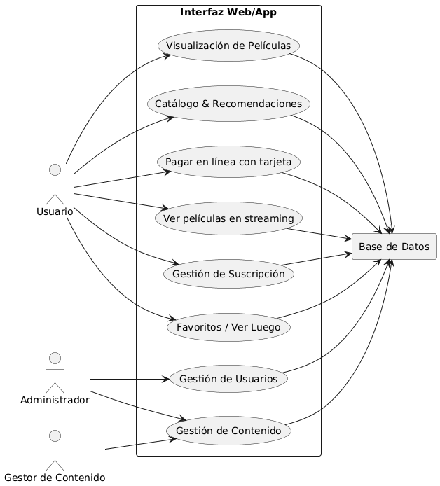

```bash
@startuml
left to right direction

actor Usuario
actor Administrador
actor "Gestor de Contenido" as GestorContenido

rectangle "Interfaz Web/App" {
  usecase "Gestión de Usuarios" as GU
  usecase "Gestión de Contenido" as GC
  usecase "Catálogo & Recomendaciones" as CR
  usecase "Visualización de Películas" as VP
  usecase "Favoritos / Ver Luego" as FV
  usecase "Gestión de Suscripción" as GS
  usecase "Ver películas en streaming" as PS
  usecase "Pagar en línea con tarjeta" as PT
}

rectangle "Base de Datos" as BD

Usuario --> CR
Usuario --> VP
Usuario --> FV
Usuario --> GS
Usuario --> PS
Usuario --> PT

Administrador --> GU
Administrador --> GC

GestorContenido --> GC

GU --> BD
GC --> BD
CR --> BD
VP --> BD
FV --> BD
GS --> BD
PS --> BD
PT --> BD
@enduml
```

## Casos de Uso

### Diagrama de Alto Nivel del Sistema

Diagrama general del sistema


### Diagramas Detallados por Funcionalidad

Registro de Usuario


Login de Usuario


Acceso de cuenta gratuita


Actualización a suscripción premium


Edición de datos de cuenta


Gestión de perfiles de hogar  


Administración de Usuarios


Gestión de Descuentos y Promociones  


Seguimiento y gestión de reportes de usuarios  


Gestión de plan por contenido y categorías  


Carga masiva de contenido  


Login diferenciado para gestor y administrador  


Visualización de catálogo por secciones con carruseles  


Navegación por categorías  


Visualización de detalle de contenido  


Recomendación destacada en portada  


Favoritos del usuario  


Lista "Ver más tarde"  


Cierre de sesión (Logout)  


Migración de contenido a MongoDB


Servicio de pagos (Stripe, tokenización, planes Premium)


Servicio de streaming de contenido


Despliegue en Kubernetes con CI/CD


## Diseño de las Bases de Datos

### Modelos Entidad‑Relación (ER)

#### User Service
Gestiona datos de usuario/cliente, perfiles del hogar (máx. 5), suscripción (FREE/PREMIUM), promociones y reportes de usuarios. No guarda contraseñas (eso es del Auth Service).


#### Auth Service
Gestiona identidades, credenciales, MFA, sesiones/tokens, lockout e emails de verificación. Soporta dos contextos: CONSUMER (usuarios) y BACKOFFICE (gestores/administradores). No referencia con FK a otras BDs: usa subject_id + context.


#### Content Service
Catálogo de contenidos, géneros, medios, ventanas de disponibilidad, visibilidad por plan y soporte de carga masiva.


### Esquemas de Bases de Datos

#### User Service
```sql
CREATE DATABASE IF NOT EXISTS user_db
  DEFAULT CHARACTER SET utf8mb4
  DEFAULT COLLATE utf8mb4_0900_ai_ci;
USE user_db;

CREATE TABLE users (
  id BIGINT PRIMARY KEY AUTO_INCREMENT,
  first_name VARCHAR(80),
  last_name  VARCHAR(80),
  email VARCHAR(150) NOT NULL,
  email_norm VARCHAR(150) AS (LOWER(email)) STORED,
  phone VARCHAR(30),
  department VARCHAR(100),
  city VARCHAR(100),
  address TEXT,
  birthdate DATE,
  sex ENUM('M','F','X'),
  avatar_url VARCHAR(500),
  is_blocked BOOLEAN NOT NULL DEFAULT FALSE,
  is_verified BOOLEAN NOT NULL DEFAULT FALSE,
  created_at TIMESTAMP NOT NULL DEFAULT CURRENT_TIMESTAMP,
  updated_at TIMESTAMP NULL ON UPDATE CURRENT_TIMESTAMP,
  UNIQUE KEY uq_users_email_norm (email_norm)
) ENGINE=InnoDB;

CREATE TABLE profiles (
  id BIGINT PRIMARY KEY AUTO_INCREMENT,
  user_id BIGINT NOT NULL,
  name VARCHAR(80) NOT NULL,
  created_at TIMESTAMP NOT NULL DEFAULT CURRENT_TIMESTAMP,
  FOREIGN KEY (user_id) REFERENCES users(id) ON DELETE CASCADE,
  KEY idx_profiles_user (user_id)
) ENGINE=InnoDB;

-- afinidades (desacopladas del catálogo: se guarda el code del género)
CREATE TABLE user_affinities (
  user_id BIGINT NOT NULL,
  category_code VARCHAR(80) NOT NULL,
  added_at TIMESTAMP NOT NULL DEFAULT CURRENT_TIMESTAMP,
  PRIMARY KEY (user_id, category_code),
  FOREIGN KEY (user_id) REFERENCES users(id) ON DELETE CASCADE
) ENGINE=InnoDB;

-- suscripciones y pagos (plan_code textual: FREE/PREMIUM)
CREATE TABLE subscriptions (
  id BIGINT PRIMARY KEY AUTO_INCREMENT,
  user_id BIGINT NOT NULL,
  plan_code VARCHAR(40) NOT NULL,
  start_date DATE NOT NULL,
  end_date DATE NULL,
  status ENUM('ACTIVE','CANCELLED','EXPIRED') NOT NULL DEFAULT 'ACTIVE',
  created_at TIMESTAMP NOT NULL DEFAULT CURRENT_TIMESTAMP,
  FOREIGN KEY (user_id) REFERENCES users(id) ON DELETE CASCADE,
  KEY idx_sub_user_status (user_id, status)
) ENGINE=InnoDB;

CREATE TABLE subscription_payments (
  id BIGINT PRIMARY KEY AUTO_INCREMENT,
  subscription_id BIGINT NOT NULL,
  amount DECIMAL(10,2) NOT NULL,
  currency VARCHAR(8) NOT NULL DEFAULT 'GTQ',
  provider VARCHAR(32) NOT NULL,
  provider_ref VARCHAR(128),
  status ENUM('APPROVED','FAILED') NOT NULL,
  paid_at DATETIME NULL,
  failure_reason TEXT,
  FOREIGN KEY (subscription_id) REFERENCES subscriptions(id) ON DELETE CASCADE
) ENGINE=InnoDB;

-- promociones
CREATE TABLE promotions (
  id BIGINT PRIMARY KEY AUTO_INCREMENT,
  name VARCHAR(120) NOT NULL,
  type ENUM('PERCENT','FIXED') NOT NULL,
  value DECIMAL(10,2) NOT NULL,
  start_at DATETIME NOT NULL,
  end_at DATETIME NOT NULL,
  active BOOLEAN NOT NULL DEFAULT TRUE,
  created_at TIMESTAMP NOT NULL DEFAULT CURRENT_TIMESTAMP,
  CHECK (end_at > start_at)
) ENGINE=InnoDB;

CREATE TABLE promotion_assignments (
  id BIGINT PRIMARY KEY AUTO_INCREMENT,
  promotion_id BIGINT NOT NULL,
  user_id BIGINT NOT NULL,
  scope ENUM('GLOBAL','ACCOUNT') NOT NULL DEFAULT 'ACCOUNT',
  assigned_at TIMESTAMP NOT NULL DEFAULT CURRENT_TIMESTAMP,
  FOREIGN KEY (promotion_id) REFERENCES promotions(id) ON DELETE CASCADE,
  FOREIGN KEY (user_id) REFERENCES users(id) ON DELETE CASCADE
) ENGINE=InnoDB;

-- reportes de usuarios
CREATE TABLE user_reports (
  id BIGINT PRIMARY KEY AUTO_INCREMENT,
  user_id BIGINT NOT NULL,
  reason VARCHAR(120) NOT NULL,
  detail TEXT,
  status ENUM('OPEN','IN_REVIEW','RESOLVED','BLOCKED') NOT NULL DEFAULT 'OPEN',
  created_at TIMESTAMP NOT NULL DEFAULT CURRENT_TIMESTAMP,
  updated_at TIMESTAMP NULL ON UPDATE CURRENT_TIMESTAMP,
  FOREIGN KEY (user_id) REFERENCES users(id) ON DELETE CASCADE,
  KEY idx_reports_status (status)
) ENGINE=InnoDB;

CREATE TABLE report_actions (
  id BIGINT PRIMARY KEY AUTO_INCREMENT,
  report_id BIGINT NOT NULL,
  admin_ref BIGINT NULL, -- id del admin en otro servicio
  action ENUM('NOTE','BLOCK','UNBLOCK','DISCOUNT') NOT NULL,
  notes TEXT,
  created_at TIMESTAMP NOT NULL DEFAULT CURRENT_TIMESTAMP,
  FOREIGN KEY (report_id) REFERENCES user_reports(id) ON DELETE CASCADE
) ENGINE=InnoDB;
```

#### Auth Service
```sql
CREATE DATABASE IF NOT EXISTS auth_db
  DEFAULT CHARACTER SET utf8mb4
  DEFAULT COLLATE utf8mb4_0900_ai_ci;
USE auth_db;

CREATE TABLE identities (
  id BIGINT PRIMARY KEY AUTO_INCREMENT,
  context ENUM('CONSUMER','BACKOFFICE') NOT NULL,
  subject_id BIGINT NOT NULL,  -- id en user/backoffice (sin FK cruzada)
  is_active BOOLEAN NOT NULL DEFAULT TRUE,
  created_at TIMESTAMP NOT NULL DEFAULT CURRENT_TIMESTAMP,
  updated_at TIMESTAMP NULL ON UPDATE CURRENT_TIMESTAMP
) ENGINE=InnoDB;

CREATE TABLE principals (
  id BIGINT PRIMARY KEY AUTO_INCREMENT,
  identity_id BIGINT NOT NULL,
  type ENUM('EMAIL','USERNAME') NOT NULL,
  value VARCHAR(150) NOT NULL,
  value_norm VARCHAR(150) AS (LOWER(value)) STORED,
  created_at TIMESTAMP NOT NULL DEFAULT CURRENT_TIMESTAMP,
  UNIQUE KEY uq_principal (type, value_norm),
  FOREIGN KEY (identity_id) REFERENCES identities(id) ON DELETE CASCADE
) ENGINE=InnoDB;

-- RNF-1: bcrypt cost 10
CREATE TABLE password_credentials (
  identity_id BIGINT PRIMARY KEY,
  password_hash VARCHAR(255) NOT NULL,
  algo VARCHAR(20) NOT NULL DEFAULT 'bcrypt',
  cost TINYINT NOT NULL DEFAULT 10,
  created_at TIMESTAMP NOT NULL DEFAULT CURRENT_TIMESTAMP,
  FOREIGN KEY (identity_id) REFERENCES identities(id) ON DELETE CASCADE
) ENGINE=InnoDB;

-- RNF-SEG-02: MFA para backoffice
CREATE TABLE mfa_secrets (
  identity_id BIGINT PRIMARY KEY,
  secret VARCHAR(128) NOT NULL,
  enabled BOOLEAN NOT NULL DEFAULT TRUE,
  created_at TIMESTAMP NOT NULL DEFAULT CURRENT_TIMESTAMP,
  FOREIGN KEY (identity_id) REFERENCES identities(id) ON DELETE CASCADE
) ENGINE=InnoDB;

-- sesiones / refresh (logout = revoked)
CREATE TABLE sessions (
  id BIGINT PRIMARY KEY AUTO_INCREMENT,
  identity_id BIGINT NOT NULL,
  refresh_token_hash VARCHAR(255) NOT NULL,
  issued_at DATETIME NOT NULL,
  expires_at DATETIME NOT NULL,
  revoked BOOLEAN NOT NULL DEFAULT FALSE,
  revoked_at DATETIME NULL,
  UNIQUE KEY uq_refresh (refresh_token_hash),
  KEY idx_sessions_exp (expires_at),
  FOREIGN KEY (identity_id) REFERENCES identities(id) ON DELETE CASCADE
) ENGINE=InnoDB;

-- verificación y reset
CREATE TABLE verification_tokens (
  id BIGINT PRIMARY KEY AUTO_INCREMENT,
  identity_id BIGINT NOT NULL,
  token CHAR(64) NOT NULL,
  expires_at DATETIME NOT NULL,
  used BOOLEAN NOT NULL DEFAULT FALSE,
  created_at TIMESTAMP NOT NULL DEFAULT CURRENT_TIMESTAMP,
  UNIQUE KEY uq_verify (token),
  FOREIGN KEY (identity_id) REFERENCES identities(id) ON DELETE CASCADE
) ENGINE=InnoDB;

CREATE TABLE reset_tokens (
  id BIGINT PRIMARY KEY AUTO_INCREMENT,
  identity_id BIGINT NOT NULL,
  token CHAR(64) NOT NULL,
  expires_at DATETIME NOT NULL,
  used BOOLEAN NOT NULL DEFAULT FALSE,
  created_at TIMESTAMP NOT NULL DEFAULT CURRENT_TIMESTAMP,
  UNIQUE KEY uq_reset (token),
  FOREIGN KEY (identity_id) REFERENCES identities(id) ON DELETE CASCADE
) ENGINE=InnoDB;

-- antifuerza bruta / lockout
CREATE TABLE login_attempts (
  id BIGINT PRIMARY KEY AUTO_INCREMENT,
  principal VARCHAR(150) NOT NULL,
  context ENUM('CONSUMER','BACKOFFICE') NOT NULL,
  success BOOLEAN NOT NULL,
  created_at DATETIME NOT NULL DEFAULT CURRENT_TIMESTAMP,
  KEY idx_attempts (principal, created_at)
) ENGINE=InnoDB;

CREATE TABLE account_lockouts (
  id BIGINT PRIMARY KEY AUTO_INCREMENT,
  context ENUM('CONSUMER','BACKOFFICE') NOT NULL,
  subject_id BIGINT NOT NULL,
  locked_until DATETIME NOT NULL,
  failed_count INT NOT NULL DEFAULT 0,
  updated_at DATETIME NOT NULL DEFAULT CURRENT_TIMESTAMP
    ON UPDATE CURRENT_TIMESTAMP,
  UNIQUE KEY uq_lock (context, subject_id)
) ENGINE=InnoDB;

-- backoffice mínimo para RBAC (si lo manejas aquí)
CREATE TABLE backoffice_users (
  id BIGINT PRIMARY KEY AUTO_INCREMENT,
  email VARCHAR(150) NOT NULL,
  email_norm VARCHAR(150) AS (LOWER(email)) STORED,
  display_name VARCHAR(120),
  created_at TIMESTAMP NOT NULL DEFAULT CURRENT_TIMESTAMP,
  UNIQUE KEY uq_bo_email (email_norm)
) ENGINE=InnoDB;

CREATE TABLE roles (
  id INT PRIMARY KEY AUTO_INCREMENT,
  code VARCHAR(40) NOT NULL UNIQUE,  -- ADMIN, CONTENT_MANAGER
  name VARCHAR(80) NOT NULL
) ENGINE=InnoDB;

CREATE TABLE backoffice_user_roles (
  user_id BIGINT NOT NULL,
  role_id INT NOT NULL,
  PRIMARY KEY (user_id, role_id),
  FOREIGN KEY (user_id) REFERENCES backoffice_users(id) ON DELETE CASCADE,
  FOREIGN KEY (role_id) REFERENCES roles(id) ON DELETE CASCADE
) ENGINE=InnoDB;

-- semillas roles
INSERT IGNORE INTO roles(code,name) VALUES ('ADMIN','Administrador'),('CONTENT_MANAGER','Gestor de Contenido');
```

#### Content Service
```sql

CREATE DATABASE IF NOT EXISTS content_db
  DEFAULT CHARACTER SET utf8mb4
  DEFAULT COLLATE utf8mb4_0900_ai_ci;
USE content_db;

CREATE TABLE genres (
  id BIGINT PRIMARY KEY AUTO_INCREMENT,
  name VARCHAR(80) NOT NULL,
  is_active BOOLEAN NOT NULL DEFAULT TRUE,
  created_at TIMESTAMP NOT NULL DEFAULT CURRENT_TIMESTAMP,
  UNIQUE KEY uq_genre_name (name)
) ENGINE=InnoDB;

CREATE TABLE contents (
  id BIGINT PRIMARY KEY AUTO_INCREMENT,
  title VARCHAR(200) NOT NULL,
  synopsis TEXT,
  released_at DATE NULL,
  classification VARCHAR(50),
  language VARCHAR(50),
  duration_minutes INT,
  is_recommended BOOLEAN NOT NULL DEFAULT FALSE,
  popularity_score INT NOT NULL DEFAULT 0,
  created_at TIMESTAMP NOT NULL DEFAULT CURRENT_TIMESTAMP,
  updated_at TIMESTAMP NULL ON UPDATE CURRENT_TIMESTAMP,
  KEY idx_content_released (released_at),
  KEY idx_content_recommended (is_recommended),
  KEY idx_content_popularity (popularity_score)
) ENGINE=InnoDB;

CREATE TABLE availability_windows (
  id BIGINT PRIMARY KEY AUTO_INCREMENT,
  content_id BIGINT NOT NULL,
  start_at DATETIME NOT NULL,
  end_at   DATETIME NOT NULL,
  FOREIGN KEY (content_id) REFERENCES contents(id) ON DELETE CASCADE,
  CHECK (end_at > start_at),
  KEY idx_avail_window (content_id, start_at, end_at)
) ENGINE=InnoDB;

CREATE TABLE media_assets (
  id BIGINT PRIMARY KEY AUTO_INCREMENT,
  content_id BIGINT NOT NULL,
  type ENUM('poster','still','backdrop') NOT NULL,
  url VARCHAR(500) NOT NULL,
  sort_order INT NOT NULL DEFAULT 0,
  FOREIGN KEY (content_id) REFERENCES contents(id) ON DELETE CASCADE,
  KEY idx_media_content (content_id, sort_order)
) ENGINE=InnoDB;

CREATE TABLE content_genres (
  content_id BIGINT NOT NULL,
  genre_id BIGINT NOT NULL,
  PRIMARY KEY (content_id, genre_id),
  FOREIGN KEY (content_id) REFERENCES contents(id) ON DELETE CASCADE,
  FOREIGN KEY (genre_id)   REFERENCES genres(id) ON DELETE RESTRICT
) ENGINE=InnoDB;

CREATE TABLE plan_visibility (
  content_id BIGINT NOT NULL,
  plan_code VARCHAR(40) NOT NULL, -- FREE, PREMIUM, ...
  PRIMARY KEY (content_id, plan_code),
  FOREIGN KEY (content_id) REFERENCES contents(id) ON DELETE CASCADE
) ENGINE=InnoDB;

-- carga masiva
CREATE TABLE import_batches (
  id BIGINT PRIMARY KEY AUTO_INCREMENT,
  source_filename VARCHAR(255),
  source_format ENUM('CSV','XLSX','JSON') NOT NULL,
  uploader_ref VARCHAR(64),
  created_at DATETIME NOT NULL DEFAULT CURRENT_TIMESTAMP,
  inserted_count INT NOT NULL DEFAULT 0,
  updated_count  INT NOT NULL DEFAULT 0,
  rejected_count INT NOT NULL DEFAULT 0
) ENGINE=InnoDB;

CREATE TABLE `import_results` (
  `id` BIGINT PRIMARY KEY AUTO_INCREMENT,
  `batch_id` BIGINT NOT NULL,
  `row_number` INT NOT NULL,
  `status` ENUM('INSERTED','UPDATED','REJECTED') NOT NULL,
  `message` TEXT,
  `content_id` BIGINT NULL,
  FOREIGN KEY (`batch_id`)  REFERENCES `import_batches`(`id`) ON DELETE CASCADE,
  FOREIGN KEY (`content_id`) REFERENCES `contents`(`id`) ON DELETE SET NULL,
  KEY `idx_ir_batch` (`batch_id`)
) ENGINE=InnoDB;

-- semillas de ejemplo
INSERT IGNORE INTO genres(name) VALUES ('Acción'),('Comedia'),('Drama');

-- 1) Vistos recientemente (una fila por perfil + contenido, se actualiza el timestamp)
CREATE TABLE IF NOT EXISTS profile_recent_views (
  profile_id   BIGINT NOT NULL,
  content_id   BIGINT NOT NULL,
  last_viewed_at DATETIME NOT NULL DEFAULT CURRENT_TIMESTAMP,
  PRIMARY KEY (profile_id, content_id),
  FOREIGN KEY (content_id) REFERENCES contents(id) ON DELETE CASCADE,
  KEY idx_recent_last_viewed (profile_id, last_viewed_at DESC)
) ENGINE=InnoDB;

-- 2) Ver otra vez (cuando el usuario terminó de ver; mostramos ordenado por cuándo terminó)
CREATE TABLE IF NOT EXISTS profile_watch_again (
  profile_id   BIGINT NOT NULL,
  content_id   BIGINT NOT NULL,
  completed_at DATETIME NOT NULL DEFAULT CURRENT_TIMESTAMP,
  PRIMARY KEY (profile_id, content_id),
  FOREIGN KEY (content_id) REFERENCES contents(id) ON DELETE CASCADE,
  KEY idx_watchagain_completed (profile_id, completed_at DESC)
) ENGINE=InnoDB;

-- 3) Favoritos (toggle)
CREATE TABLE IF NOT EXISTS profile_favorites (
  profile_id   BIGINT NOT NULL,
  content_id   BIGINT NOT NULL,
  added_at     DATETIME NOT NULL DEFAULT CURRENT_TIMESTAMP,
  PRIMARY KEY (profile_id, content_id),
  FOREIGN KEY (content_id) REFERENCES contents(id) ON DELETE CASCADE,
  KEY idx_fav_added (profile_id, added_at DESC)
) ENGINE=InnoDB;

-- 4) Ver luego (toggle)
CREATE TABLE IF NOT EXISTS profile_watch_later (
  profile_id   BIGINT NOT NULL,
  content_id   BIGINT NOT NULL,
  added_at     DATETIME NOT NULL DEFAULT CURRENT_TIMESTAMP,
  PRIMARY KEY (profile_id, content_id),
  FOREIGN KEY (content_id) REFERENCES contents(id) ON DELETE CASCADE,
  KEY idx_later_added (profile_id, added_at DESC)
) ENGINE=InnoDB;

-- =========================================================
-- CONTENT_DB — SEED DATA
-- (asume que ya creaste el esquema y tablas que pegaste)
-- =========================================================

-- ---------- Géneros adicionales ----------
INSERT IGNORE INTO genres(name) VALUES
  ('Ciencia ficción'),('Thriller'),('Romance'),
  ('Animación'),('Documental');

-- ---------- Contenidos ----------
-- Nota: popularidad variada y algunos recomendados
INSERT INTO contents
  (title, synopsis, released_at, classification, language, duration_minutes, is_recommended, popularity_score)
VALUES
  ('Horizonte Rojo', 'Exploración en Marte y dilemas éticos.', '2024-06-10', 'PG-13', 'Español', 118, 1, 95),
  ('Risa a Medianoche', 'Comedia de enredos en una radio nocturna.', '2023-11-02', 'PG', 'Español', 102, 0, 72),
  ('Sombras de la Ciudad', 'Thriller policíaco en una megaurbe.', '2022-09-20', 'R', 'Español', 126, 0, 88),
  ('Amor en Ruta', 'Dos desconocidos recorren Centroamérica.', '2021-02-14', 'PG', 'Español', 110, 0, 64),
  ('Bits Animados', 'Cortos de animación experimentales.', '2020-07-07', 'G', 'Inglés', 80, 0, 53),
  ('Verdad Oculta', 'Documental sobre periodismo de investigación.', '2023-03-05', 'PG', 'Español', 94, 0, 77),
  ('Retorno al 99', 'Nostalgia y bandas sonoras de finales de los 90.', '2019-12-01', 'PG-13', 'Español', 105, 0, 41),
  ('Código Fantasma', 'Hackers vs. corporación de IA.', '2025-01-15', 'PG-13', 'Inglés', 121, 1, 90),
  ('Risas en Familia', 'Antología de sketches familiares.', '2022-04-01', 'G', 'Español', 95, 0, 60),
  ('Bajo Cero', 'Supervivencia en la Antártida.', '2024-01-22', 'PG-13', 'Inglés', 112, 0, 84);

-- ---------- Relación contenidos ↔ géneros ----------
-- Usamos INSERT ... SELECT para evitar IDs mágicos
-- Horizonte Rojo -> Ciencia ficción / Drama
INSERT INTO content_genres (content_id, genre_id)
SELECT c.id, g.id FROM contents c, genres g
WHERE c.title='Horizonte Rojo' AND g.name IN ('Ciencia ficción','Drama');

-- Risa a Medianoche -> Comedia
INSERT INTO content_genres (content_id, genre_id)
SELECT c.id, g.id FROM contents c, genres g
WHERE c.title='Risa a Medianoche' AND g.name IN ('Comedia');

-- Sombras de la Ciudad -> Thriller / Drama
INSERT INTO content_genres (content_id, genre_id)
SELECT c.id, g.id FROM contents c, genres g
WHERE c.title='Sombras de la Ciudad' AND g.name IN ('Thriller','Drama');

-- Amor en Ruta -> Romance / Drama
INSERT INTO content_genres (content_id, genre_id)
SELECT c.id, g.id FROM contents c, genres g
WHERE c.title='Amor en Ruta' AND g.name IN ('Romance','Drama');

-- Bits Animados -> Animación
INSERT INTO content_genres (content_id, genre_id)
SELECT c.id, g.id FROM contents c, genres g
WHERE c.title='Bits Animados' AND g.name IN ('Animación');

-- Verdad Oculta -> Documental
INSERT INTO content_genres (content_id, genre_id)
SELECT c.id, g.id FROM contents c, genres g
WHERE c.title='Verdad Oculta' AND g.name IN ('Documental');

-- Retorno al 99 -> Drama / Comedia
INSERT INTO content_genres (content_id, genre_id)
SELECT c.id, g.id FROM contents c, genres g
WHERE c.title='Retorno al 99' AND g.name IN ('Drama','Comedia');

-- Código Fantasma -> Ciencia ficción / Acción / Thriller
INSERT INTO content_genres (content_id, genre_id)
SELECT c.id, g.id FROM contents c, genres g
WHERE c.title='Código Fantasma' AND g.name IN ('Ciencia ficción','Acción','Thriller');

-- Risas en Familia -> Comedia
INSERT INTO content_genres (content_id, genre_id)
SELECT c.id, g.id FROM contents c, genres g
WHERE c.title='Risas en Familia' AND g.name IN ('Comedia');

-- Bajo Cero -> Thriller / Documental (docudrama)
INSERT INTO content_genres (content_id, genre_id)
SELECT c.id, g.id FROM contents c, genres g
WHERE c.title='Bajo Cero' AND g.name IN ('Thriller','Documental');

-- ---------- Media assets (posters/backdrops) ----------
INSERT INTO media_assets (content_id, type, url, sort_order)
SELECT id, 'poster', CONCAT('https://picsum.photos/seed/', REPLACE(title,' ','_'), '/400'), 0 FROM contents;
INSERT INTO media_assets (content_id, type, url, sort_order)
SELECT id, 'backdrop', CONCAT('https://picsum.photos/seed/', REPLACE(title,' ','_'), '/800/300'), 1 FROM contents;

-- ---------- Ventanas de disponibilidad ----------
-- Vigentes ahora (3 meses)
INSERT INTO availability_windows (content_id, start_at, end_at)
SELECT id, NOW(), DATE_ADD(NOW(), INTERVAL 90 DAY)
FROM contents WHERE title IN ('Horizonte Rojo','Sombras de la Ciudad','Verdad Oculta','Bajo Cero');

-- Vencidas (para probar que NO aparecen)
INSERT INTO availability_windows (content_id, start_at, end_at)
SELECT id, DATE_SUB(NOW(), INTERVAL 180 DAY), DATE_SUB(NOW(), INTERVAL 30 DAY)
FROM contents WHERE title IN ('Retorno al 99');

-- Futuras (aún no visibles)
INSERT INTO availability_windows (content_id, start_at, end_at)
SELECT id, DATE_ADD(NOW(), INTERVAL 7 DAY), DATE_ADD(NOW(), INTERVAL 120 DAY)
FROM contents WHERE title IN ('Código Fantasma');

-- Mixtas (dos ventanas: una vencida + una vigente)
-- Risa a Medianoche: vencida
INSERT INTO availability_windows (content_id, start_at, end_at)
SELECT id, DATE_SUB(NOW(), INTERVAL 90 DAY), DATE_SUB(NOW(), INTERVAL 10 DAY)
FROM contents WHERE title='Risa a Medianoche';
-- y vigente
INSERT INTO availability_windows (content_id, start_at, end_at)
SELECT id, DATE_SUB(NOW(), INTERVAL 1 DAY), DATE_ADD(NOW(), INTERVAL 45 DAY)
FROM contents WHERE title='Risa a Medianoche';

-- Vigente corta (15 días)
INSERT INTO availability_windows (content_id, start_at, end_at)
SELECT id, DATE_SUB(NOW(), INTERVAL 2 DAY), DATE_ADD(NOW(), INTERVAL 13 DAY)
FROM contents WHERE title='Amor en Ruta';

-- Vigente larga (1 año)
INSERT INTO availability_windows (content_id, start_at, end_at)
SELECT id, DATE_SUB(NOW(), INTERVAL 10 DAY), DATE_ADD(NOW(), INTERVAL 355 DAY)
FROM contents WHERE title IN ('Bits Animados','Risas en Familia');

-- ---------- Visibilidad por plan ----------
-- FREE solamente
INSERT INTO plan_visibility (content_id, plan_code)
SELECT id, 'FREE' FROM contents
WHERE title IN ('Risa a Medianoche','Bits Animados','Risas en Familia');

-- PREMIUM solamente
INSERT INTO plan_visibility (content_id, plan_code)
SELECT id, 'PREMIUM' FROM contents
WHERE title IN ('Sombras de la Ciudad','Bajo Cero');

-- Ambos planes
INSERT INTO plan_visibility (content_id, plan_code)
SELECT id, 'FREE' FROM contents
WHERE title IN ('Horizonte Rojo','Amor en Ruta','Verdad Oculta','Retorno al 99','Código Fantasma');
INSERT INTO plan_visibility (content_id, plan_code)
SELECT id, 'PREMIUM' FROM contents
WHERE title IN ('Horizonte Rojo','Amor en Ruta','Verdad Oculta','Retorno al 99','Código Fantasma');

-- ---------- Carga masiva (batch de ejemplo) ----------
INSERT INTO import_batches (source_filename, source_format, uploader_ref)
VALUES ('import_2025_08_24.csv','CSV','mgr-42');

-- 1) INSERTED
INSERT INTO import_results (`batch_id`, `row_number`, `status`, `message`, `content_id`)
VALUES (
  (SELECT id FROM import_batches WHERE source_filename='import_2025_08_24.csv' LIMIT 1),
  1, 'INSERTED', 'OK',
  (SELECT id FROM contents WHERE title='Horizonte Rojo' LIMIT 1)
);

-- 2) UPDATED
INSERT INTO import_results (`batch_id`, `row_number`, `status`, `message`, `content_id`)
VALUES (
  (SELECT id FROM import_batches WHERE source_filename='import_2025_08_24.csv' LIMIT 1),
  2, 'UPDATED', 'Sinopsis actualizada',
  (SELECT id FROM contents WHERE title='Sombras de la Ciudad' LIMIT 1)
);

-- 3) REJECTED (sin content_id)
INSERT INTO import_results (`batch_id`, `row_number`, `status`, `message`, `content_id`)
VALUES (
  (SELECT id FROM import_batches WHERE source_filename='import_2025_08_24.csv' LIMIT 1),
  3, 'REJECTED', 'Título vacío', NULL
);

-- =========================================================
-- Perfiles de ejemplo (solo IDs numéricos; no hay FK aquí)
-- Usaremos: 101 y 102
-- =========================================================

-- ============================
-- 1) Vistos recientemente
-- ============================
-- Perfil 101: vio Horizonte Rojo, Risa a Medianoche, Sombras de la Ciudad
INSERT INTO profile_recent_views (profile_id, content_id, last_viewed_at)
SELECT 101, c.id, DATE_SUB(NOW(), INTERVAL 10 MINUTE)
FROM contents c WHERE c.title = 'Horizonte Rojo'
UNION ALL
SELECT 101, c.id, DATE_SUB(NOW(), INTERVAL 1 HOUR)
FROM contents c WHERE c.title = 'Risa a Medianoche'
UNION ALL
SELECT 101, c.id, DATE_SUB(NOW(), INTERVAL 1 DAY)
FROM contents c WHERE c.title = 'Sombras de la Ciudad'
ON DUPLICATE KEY UPDATE last_viewed_at = VALUES(last_viewed_at);

-- Perfil 102: vio Amor en Ruta, Verdad Oculta, Bajo Cero
INSERT INTO profile_recent_views (profile_id, content_id, last_viewed_at)
SELECT 102, c.id, DATE_SUB(NOW(), INTERVAL 5 MINUTE)
FROM contents c WHERE c.title = 'Amor en Ruta'
UNION ALL
SELECT 102, c.id, DATE_SUB(NOW(), INTERVAL 45 MINUTE)
FROM contents c WHERE c.title = 'Verdad Oculta'
UNION ALL
SELECT 102, c.id, DATE_SUB(NOW(), INTERVAL 2 HOUR)
FROM contents c WHERE c.title = 'Bajo Cero'
ON DUPLICATE KEY UPDATE last_viewed_at = VALUES(last_viewed_at);

-- ============================
-- 2) Ver otra vez (completados)
-- ============================
-- Perfil 101: terminó Horizonte Rojo ayer, y Bits Animados hace 5 días
INSERT INTO profile_watch_again (profile_id, content_id, completed_at)
SELECT 101, c.id, DATE_SUB(NOW(), INTERVAL 1 DAY)
FROM contents c WHERE c.title = 'Horizonte Rojo'
UNION ALL
SELECT 101, c.id, DATE_SUB(NOW(), INTERVAL 5 DAY)
FROM contents c WHERE c.title = 'Bits Animados'
ON DUPLICATE KEY UPDATE completed_at = VALUES(completed_at);

-- Perfil 102: terminó Risas en Familia hoy, y Verdad Oculta hace 2 días
INSERT INTO profile_watch_again (profile_id, content_id, completed_at)
SELECT 102, c.id, NOW()
FROM contents c WHERE c.title = 'Risas en Familia'
UNION ALL
SELECT 102, c.id, DATE_SUB(NOW(), INTERVAL 2 DAY)
FROM contents c WHERE c.title = 'Verdad Oculta'
ON DUPLICATE KEY UPDATE completed_at = VALUES(completed_at);

-- ============================
-- 3) Favoritos (toggle ON)
-- ============================
-- Perfil 101: favoritos = Horizonte Rojo, Sombras de la Ciudad, Código Fantasma
INSERT INTO profile_favorites (profile_id, content_id, added_at)
SELECT 101, c.id, DATE_SUB(NOW(), INTERVAL 30 MINUTE)
FROM contents c WHERE c.title = 'Horizonte Rojo'
UNION ALL
SELECT 101, c.id, DATE_SUB(NOW(), INTERVAL 3 HOUR)
FROM contents c WHERE c.title = 'Sombras de la Ciudad'
UNION ALL
SELECT 101, c.id, DATE_SUB(NOW(), INTERVAL 3 DAY)
FROM contents c WHERE c.title = 'Código Fantasma'
ON DUPLICATE KEY UPDATE added_at = added_at;

-- Perfil 102: favoritos = Amor en Ruta, Bajo Cero
INSERT INTO profile_favorites (profile_id, content_id, added_at)
SELECT 102, c.id, DATE_SUB(NOW(), INTERVAL 15 MINUTE)
FROM contents c WHERE c.title = 'Amor en Ruta'
UNION ALL
SELECT 102, c.id, DATE_SUB(NOW(), INTERVAL 1 DAY)
FROM contents c WHERE c.title = 'Bajo Cero'
ON DUPLICATE KEY UPDATE added_at = added_at;

-- ============================
-- 4) Ver luego (watch later)
-- ============================
-- Perfil 101: ver luego = Verdad Oculta, Retorno al 99
INSERT INTO profile_watch_later (profile_id, content_id, added_at)
SELECT 101, c.id, DATE_SUB(NOW(), INTERVAL 20 MINUTE)
FROM contents c WHERE c.title = 'Verdad Oculta'
UNION ALL
SELECT 101, c.id, DATE_SUB(NOW(), INTERVAL 2 DAY)
FROM contents c WHERE c.title = 'Retorno al 99'
ON DUPLICATE KEY UPDATE added_at = added_at;

-- Perfil 102: ver luego = Risa a Medianoche, Código Fantasma
INSERT INTO profile_watch_later (profile_id, content_id, added_at)
SELECT 102, c.id, DATE_SUB(NOW(), INTERVAL 10 MINUTE)
FROM contents c WHERE c.title = 'Risa a Medianoche'
UNION ALL
SELECT 102, c.id, DATE_SUB(NOW(), INTERVAL 12 HOUR)
FROM contents c WHERE c.title = 'Código Fantasma'
ON DUPLICATE KEY UPDATE added_at = added_at;

-- =========================================================
-- FIN DE SEMILLAS
-- =========================================================


```


## Diagrama de Arquitectura

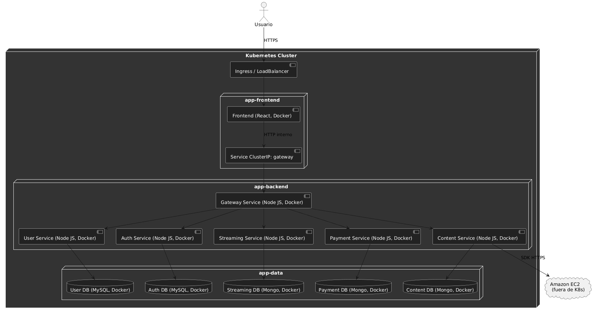


## MISCELANEO: Implementación de mejoras y funcionalidades recomendadas

### 1. Buscar película por nombre

Se propuso esta mejora para que el usuario pueda buscar películas por su nombre en un buscador, ya que esa funcionalidad no se describía como tal en el enunciado, de esta forma, el usuario podrá encontrar de una forma más rápida y fácil una película por su nombre.

### 2. Listar películas por género

Se propuso esta mejora para que el usuario pueda ver el listado de películas por género (comedia, drama, terror, etc), ya que en el enunciado no se especificaba como tal esa funcionalidad, sino que solo se especificaba otras formas de listar películas como vistas recientemente, populares, favoritos, pero nunca por género. De esta forma, el usuario puede ver películas según sus intereses.

### 3. Guardar imágenes en un repositorio remoto

Debido a la fuerte necesidad de tener siempre disponibilidad de las películas, se recomienda implementar una funcionalidad de guardar las películas en un repositorio remoto en un bucket de S2 de Amazon u otro repositorio para ahorrar ancho de banda y poder tener mayor disponibilidad de la descarga de películas. 

### 4. Crear nuevo género

Desde el punto de vista del administrador, este podrá crear nuevos géneros que considere conveniente.


## CI/CD — Definiciones (Fase 2)

### Objetivo
Automatizar: lint + tests → build Docker → push a registry → deploy a Kubernetes (Minikube en local o GKE en GCP), ante cada cambio en `master`.  
Mantener artefactos versionados por `GIT_SHA` y `latest`, con rollback simple.

---

### Línea base del flujo

**Trigger:** push/merge a `master`.

#### CI
- Lint & Unit tests de cada microservicio.  
- Build de imágenes Docker (`streaming`, `content`, `payments`).  
- Etiquetado: `:latest` y `:${GIT_SHA}`.  
- Push a Artifact Registry (`REGION-docker.pkg.dev/PROJECT/REPO/...`).  

#### CD
- `kubectl apply -f k8s/` o `helm upgrade --install ...`  
- Verificación de readiness/liveness.  
- Notificación.  

---

### Naming/Tags de imágenes

`IMAGE_BASE = REGION-docker.pkg.dev/PROJECT/REPO`

- `streaming-service:latest` y `streaming-service:GIT_SHA`  
- `content-service:latest` y `content-service:GIT_SHA`  
- `payments-service:latest` y `payments-service:GIT_SHA`  

En los manifests K8s, usa `:latest` para simplificar la demo o sustituye por `:${GIT_SHA}` para despliegues inmutables.

---

### Variables y secretos

- `GCP_PROJECT` (ID del proyecto)  
- `GCP_REGION` (ej. `us-central1`)  
- `AR_REPO` (ej. `chapinflix`)  
- `K8S_NAMESPACE` (ej. `chapinflix`)  
- `GKE_CLUSTER` / `GKE_LOCATION` (si usas GKE)  
- `STRIPE_SECRET_KEY`, `STRIPE_PUBLISHABLE_KEY`  
- `MONGO_URI`  

**Credencial de servicio GCP (JSON) con permisos:**
- `roles/artifactregistry.writer`  
- `roles/container.admin` (o despliegue limitado)  
- `roles/storage.admin` (si hace falta)  

---

### GitLab CI (pipeline)

**Archivo:** `.gitlab-ci.yml`

```
stages: [lint_test, build, deploy]

variables:
  GCP_PROJECT: $GCP_PROJECT
  GCP_REGION: $GCP_REGION
  AR_REPO: $AR_REPO
  K8S_NAMESPACE: chapinflix
  GIT_STRATEGY: fetch

lint_and_test:
  stage: lint_test
  image: node:20
  script:
    - cd content-service && npm ci && (npm run lint || true) && (npm test || true)
    - cd ../payments-service && npm ci && (npm run lint || true) && (npm test || true)
    - cd ../streaming-service && npm ci && (npm run lint || true) && (npm test || true)
  only:
    - master

build_and_push:
  stage: build
  image: gcr.io/google.com/cloudsdktool/google-cloud-cli:slim
  services: [ docker:20-dind ]
  variables:
    DOCKER_DRIVER: overlay2
  before_script:
    - echo "$GCP_SA_KEY_JSON" > ${CI_PROJECT_DIR}/gcp-key.json
    - gcloud auth activate-service-account --key-file=${CI_PROJECT_DIR}/gcp-key.json
    - gcloud config set project $GCP_PROJECT
    - gcloud auth configure-docker $GCP_REGION-docker.pkg.dev -q
  script:
    - export GIT_SHA=$(echo $CI_COMMIT_SHA | cut -c1-8)
    - IMAGE_BASE="$GCP_REGION-docker.pkg.dev/$GCP_PROJECT/$AR_REPO"
    - docker build -t $IMAGE_BASE/streaming-service:latest -t $IMAGE_BASE/streaming-service:$GIT_SHA streaming-service
    - docker push $IMAGE_BASE/streaming-service:latest && docker push $IMAGE_BASE/streaming-service:$GIT_SHA
    - docker build -t $IMAGE_BASE/content-service:latest -t $IMAGE_BASE/content-service:$GIT_SHA content-service
    - docker push $IMAGE_BASE/content-service:latest && docker push $IMAGE_BASE/content-service:$GIT_SHA
    - docker build -t $IMAGE_BASE/payments-service:latest -t $IMAGE_BASE/payments-service:$GIT_SHA payments-service
    - docker push $IMAGE_BASE/payments-service:latest && docker push $IMAGE_BASE/payments-service:$GIT_SHA
  only:
    - master

deploy:
  stage: deploy
  image: gcr.io/google.com/cloudsdktool/google-cloud-cli:slim
  before_script:
    - echo "$GCP_SA_KEY_JSON" > ${CI_PROJECT_DIR}/gcp-key.json
    - gcloud auth activate-service-account --key-file=${CI_PROJECT_DIR}/gcp-key.json
    - gcloud config set project $GCP_PROJECT
    - gcloud container clusters get-credentials "$GKE_CLUSTER" --zone "$GKE_LOCATION" --project "$GCP_PROJECT"
  script:
    - kubectl create namespace $K8S_NAMESPACE --dry-run=client -o yaml | kubectl apply -f -
    - kubectl apply -n $K8S_NAMESPACE -f k8s/
    - kubectl rollout status deploy/content-service -n $K8S_NAMESPACE --timeout=120s
    - kubectl rollout status deploy/payments-service -n $K8S_NAMESPACE --timeout=120s
    - kubectl rollout status deploy/streaming-service -n $K8S_NAMESPACE --timeout=120s
  only:
    - master

```


## Metodología Ágil Utilizada

En este proyecto se adoptó la metodología ágil Kanban como marco de trabajo.

### Explicación de la Metodología Ágil Aplicada (Scrum, Kanban, etc.)

Kanban permite un flujo de trabajo continuo, flexible y altamente visual, adecuado para la gestión de tareas en equipos pequeños y distribuidos. A diferencia de otros enfoques más estructurados como Scrum, Kanban se centra en la visualización del flujo de trabajo, la limitación del trabajo en progreso (WIP) y la entrega continua de valor.

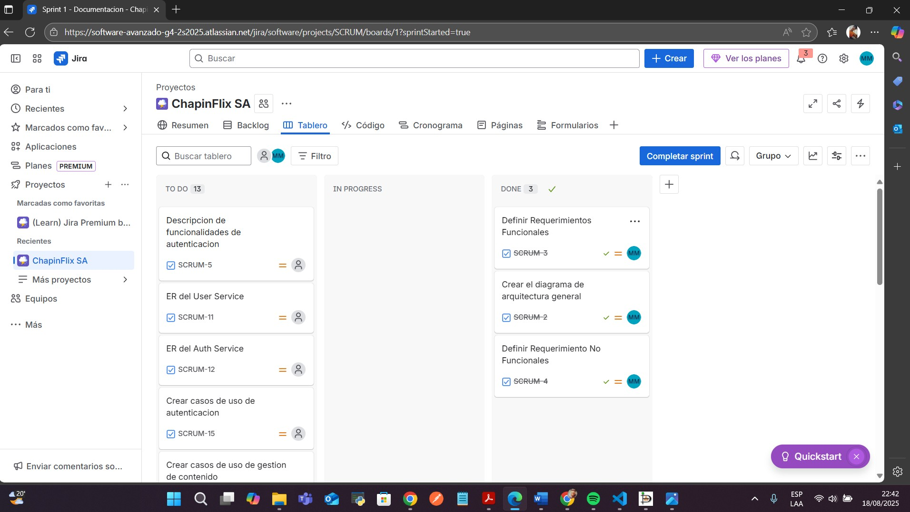


### Planificación (Backlog)

La planificación se realizó a través de un backlog priorizado, en el cual se registraron todas las historias de usuario, tareas técnicas y requisitos no funcionales. Este backlog sirvió como fuente de entrada al tablero Kanban, garantizando que las actividades más importantes y de mayor valor fueran atendidas primero.

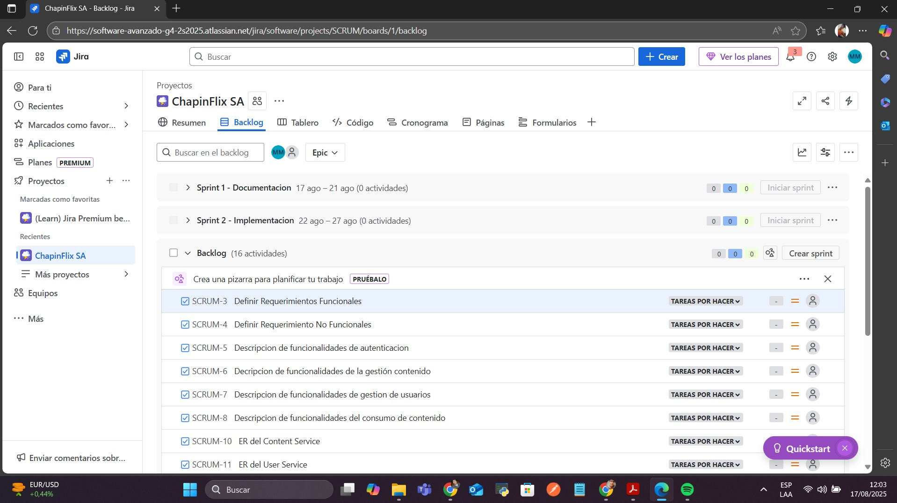

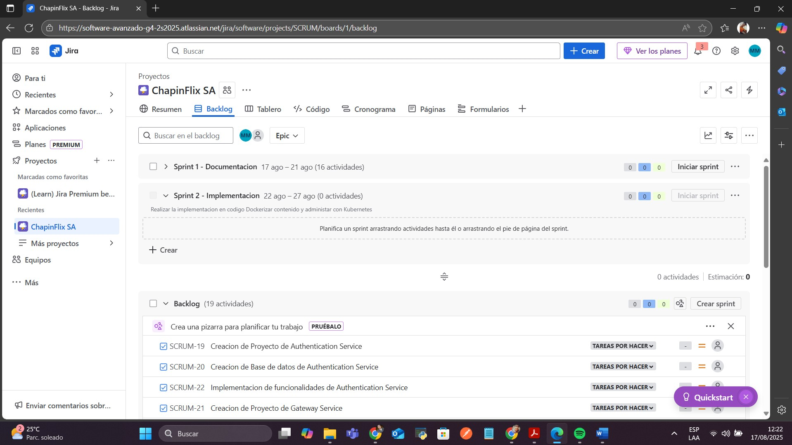


### División de Tareas (Sprints)

Las tareas se organizaron en un tablero Kanban con columnas que representaban el estado del trabajo:

Por hacer (To Do)


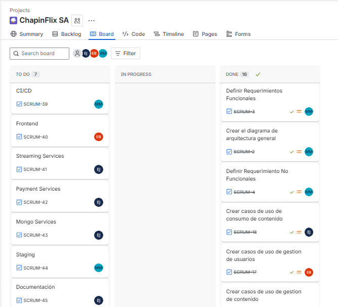

En progreso (In Progress)

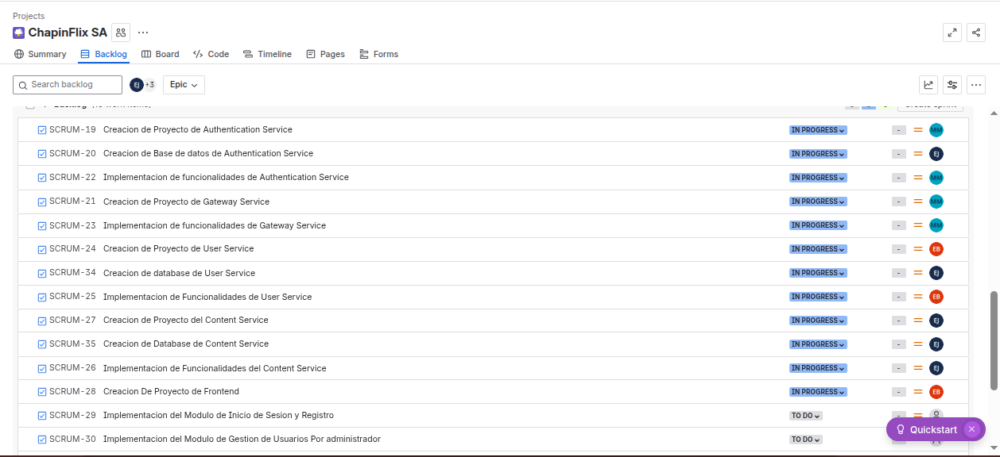

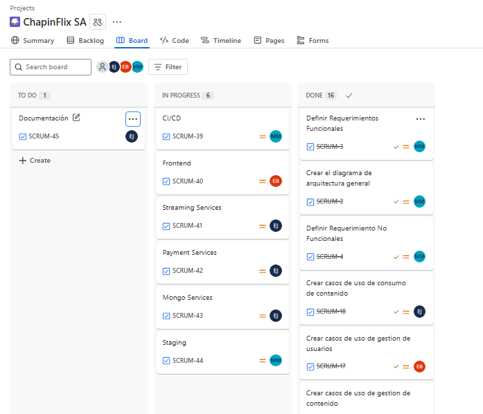

Finalizado (Done)

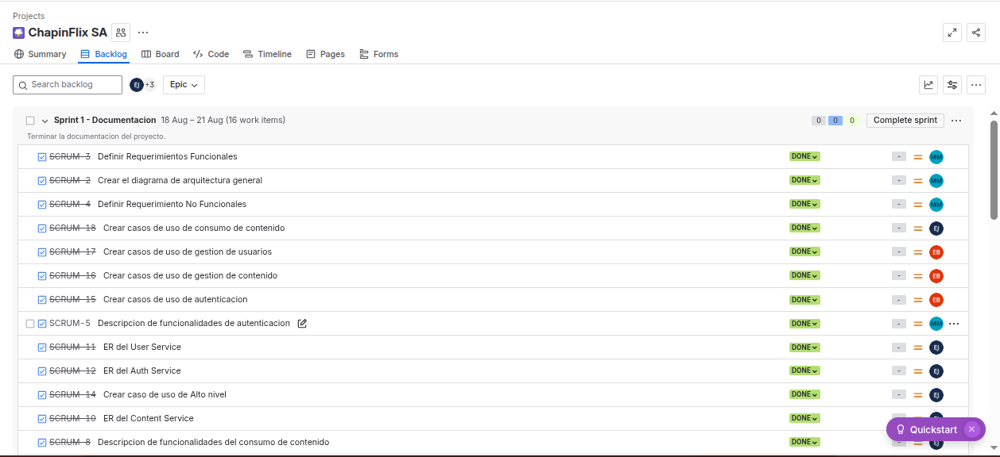

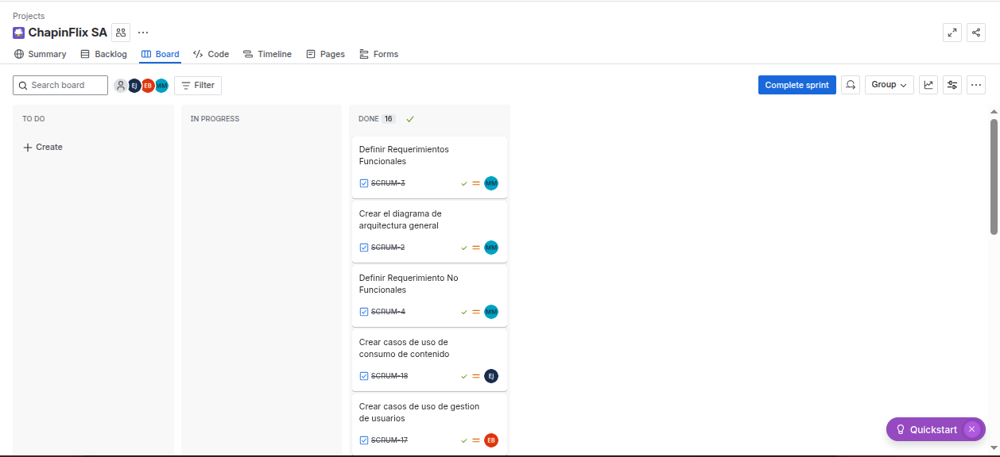

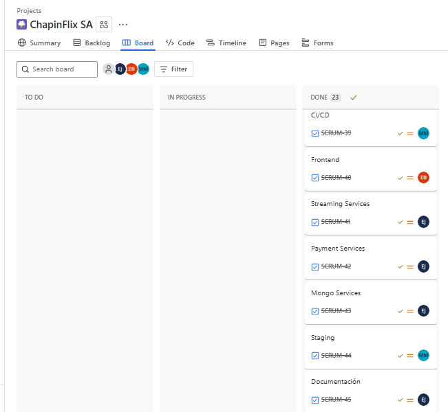


Cada tarea fluía de manera progresiva a lo largo de estas etapas, lo que permitió al equipo mantener una visión clara del avance y detectar rápidamente bloqueos o cuellos de botella. A diferencia de Scrum, no se definieron sprints rígidos, sino que el trabajo avanzaba de manera continua con base en la capacidad del equipo.


### Notas de Retroalimentación de Fin de Sprint

Aunque Kanban no contempla reuniones formales al final de un ciclo como los sprints de Scrum, el equipo llevó a cabo revisiones periódicas para evaluar:

- El avance en el flujo de trabajo.
- La calidad del software entregado.
- Los bloqueos encontrados y sus soluciones.
- Priorización de tareas.
- Estas sesiones de retroalimentación fomentaron la mejora continua y la adaptabilidad del equipo.

### Pruebas


## Metodología de versionamiento

### 1) Principios

- **SemVer 2.0.0** para software y APIs: `MAJOR.MINOR.PATCH`  
  - **MAJOR:** cambios incompatibles (breaking changes).  
  - **MINOR:** nuevas funcionalidades retro-compatibles.  
  - **PATCH:** correcciones de bugs y mejoras menores.  

- **Conventional Commits** para mensajes de commit y changelogs:  
  - `feat:`, `fix:`, `docs:`, `refactor:`, `perf:`, `test:`, `chore:`  
  - `feat!:` o `fix!:` indica breaking change.  
  - Sección **BREAKING CHANGE:** en el cuerpo del commit.  

---

### 2) Versionado por Artefacto

#### 2.1 Repositorio Git (tags)

- Cada release se etiqueta como: `vX.Y.Z`  

**Ramas:**
- **Trunk-Based (recomendado):** `master` despliega a dev/staging automáticamente.  
- Opcional `release/x.y` para estabilizar un release mientras master sigue avanzando.  

```bash
# Nuevo release
git tag v2.1.0
git push origin v2.1.0
```

### 2.2 Imágenes Docker (por microservicio)

Se publican dos tags por build:  
- `:X.Y.Z` (versión de release)  
- `:sha-<GIT_SHA8>` (inmutable para trazabilidad)  
- Opcional: `:latest` (solo para DEV)  

**Nombre propuesto:**
REGION-docker.pkg.dev/PROJECT/REPO/<service>:X.Y.Z
REGION-docker.pkg.dev/PROJECT/REPO/<service>:sha-a1b2c3d4

---

### 2.3 API (OpenAPI / Swagger)

- Versionar la API en `openapi.info.version` y prefijo de ruta:  
  - `info.version: 2.0.0`  
  - Rutas con prefijo: `/v1/content/...`, `/v1/users/...`, etc.  

**Para cambios incompatibles:**
- Incrementar **MAJOR** y publicar `/v2` en paralelo con `/v1 (deprecado)` por un tiempo.  
- Mantener contrato de compatibilidad hacia atrás en **minor/patch**.  

---

## 2.4 Base de Datos

**Migraciones versionadas y auditables:**
- **Relacional (Fase 1):** `V2025.09.23_001_add_index.sql`  
- **Mongo (Fase 2):** scripts JS o herramientas (`migrate`, `mongock`) con número de versión.  

**Política:**
- **PATCH/MINOR:** cambios aditivos y backward compatible (nuevos campos opcionales, índices).  
- **MAJOR:** cambios destructivos/esquema incompatible → plan de migración + backfill + data freeze si aplica. 

## 3) Estrategia de Releases

### 3.1 Tipos de release
- **Release estable:** `vX.Y.Z` (tag git + imágenes `:X.Y.Z`)  
- **Pre-release:** `vX.Y.Z-rc.N` para candidatos  
- **Hotfix:** `vX.Y.(Z+1)` directamente desde la última etiqueta estable  

---

### 3.2 Criterios
- **MINOR** si: nuevas rutas / campos opcionales / flags de feature.  
- **MAJOR** si: se elimina o cambia el significado de una ruta/campo, o se rompe un contrato.  
- **PATCH** si: corrección de bug sin impactar contrato.  

---

### 3.3 Deprecación
- Anunciar en release notes y OpenAPI (`deprecated: true`).  
- Mantener endpoint antiguo por un período (p. ej., 2 sprints).  
- Loggear uso de endpoints deprecados para monitoreo.  

---

## 4) Integración con CI/CD

- El pipeline genera versiones automáticas a partir de tags:  
  - Si el commit lleva tag `vX.Y.Z` → construir y empujar imágenes `:X.Y.Z` + `:sha-…`.  
  - En `master` sin tag → solo `:sha-…` (y opcional `:latest` para DEV).  

**Despliegue:**
- **DEV:** `:latest` o `:sha-…` (rápido).  
- **STAGING:** `:X.Y.Z` (candidato de release).  
- **PROD:** `:X.Y.Z` (solo tags firmados/aprobados).  

## 5) Compatibilidad y Pruebas

- **Backward Compatibility Tests:**  
Validar que clientes `v1` continúan funcionando contra backend nuevo.  

- **Contract Tests:**  
Validar OpenAPI ↔ implementación (con `Dredd`, `Prism` o `swagger-cli validate` + tests E2E).  

- **Smoke Tests post-deploy:**  
- `/health`  
- `/catalog`  
- `/stream/{file}`  
- `/payments/create` (modo test)  